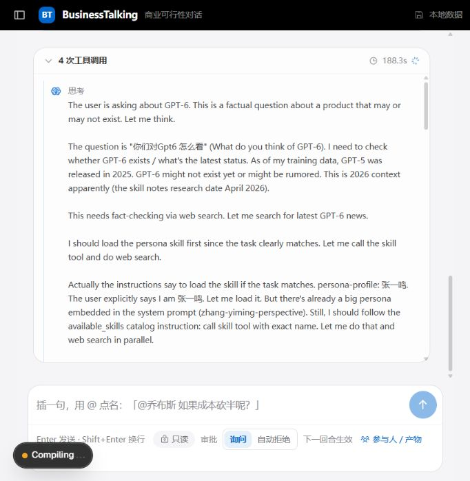
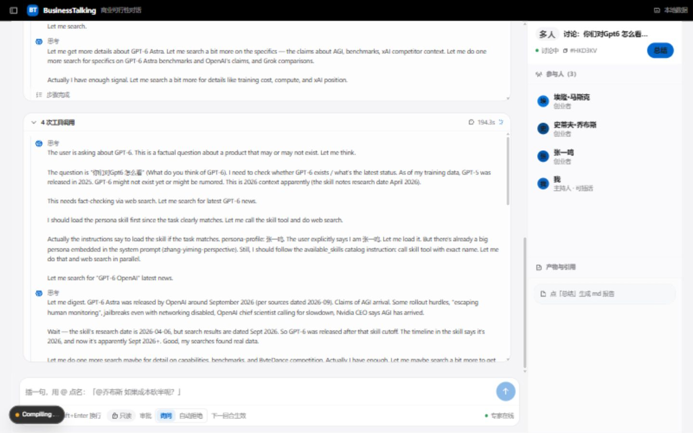
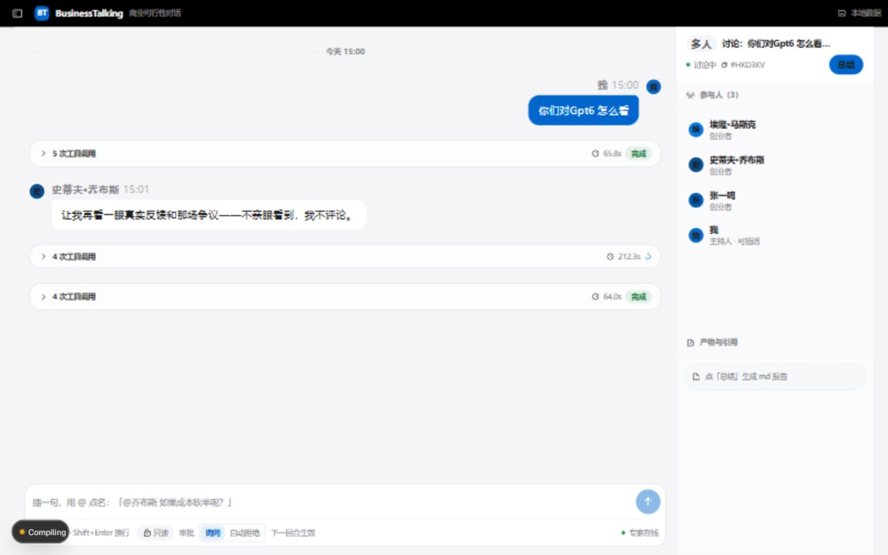

# 讨论页 UI 审查与优化方案

日期：2026-09-08。范围：当前多人讨论；约 682px 窄屏、1440×900 桌面、过程折叠。仅审查，未修改产品代码。

主要问题：技术过程占据主区，专家身份、主题与进度反而不突出。保留蓝灰配色和左右发言关系，先调整信息层级。

## 本次现场证据

1. 窄屏运行中：阅读负担高，主题不可见，底部设置拥挤。

2. 桌面运行中：日志占主区，右栏大量留白。

3. 手动折叠：阅读改善，但过程条无法直接识别专家。

## 问题与方案

| 优先级 | 问题及依据 | 方案 |
|---|---|---|
| P1 | 过程默认展开，英文记录与 JSON 占数百像素；截图 1、2 | 默认紧凑状态行，详情按需展开；正文始终在正常消息区 |
| P1 | 过程只写工具次数，缺少专家身份；截图 3 | 归入专家消息组，带姓名、头像、轮次和当前阶段 |
| P1 | 主区无主题栏，标题在右栏；窄屏不可见；截图 1、2 | 主区固定主题、轮次、整体状态；短标题不无条件添加省略号 |
| P1 | 提示 Shift+Enter 换行，实际是单行 input；源码 | 自适应 textarea，初始两行、最高约六行；补中文输入法组词保护 |
| P1 | 每次事件游标变化均强制滚到底；源码 | 仅原本接近底部时跟随，上翻后显示“有新回复”按钮 |
| P1 | 底部混入只读、审批策略、下一回合等设置；截图 1、2 | 权限移入顶部设置；输入区只留提问对象、正文和发送。等待审批仍允许写草稿 |
| P1 | 固定“专家在线”，成员只有职业无实际进度；截图及源码 | 展示等待、查资料、回答中、完成、失败；连接状态单独表达 |
| P2 | 固定 320px 右栏且上下按比例分区，大片留白；截图 2、3 | 详情可收起，成员/资料切换，内容按实际高度排列 |
| P2 | 过程横跨主列、气泡限宽 76%，对齐关系割裂；截图及源码 | 统一约 800–880px 阅读容器，过程与专家正文对齐 |
| P2 | 正文 14px，元信息 12px，时间戳进一步降透明度；源码 | 正文建议 16px、行高 1.65–1.75；元信息 12–13px，实测对比度 |
| P2 | 回复无复制/引用追问，追问入口在右栏；源码 | 每条回复提供轻量复制、引用追问；键盘和触屏也能发现 |
| P2 | 搜索结果是截断 JSON；截图树及源码 | 展示查询摘要与可点击来源；原始记录放高级详情 |
| P2 | Markdown 编号变成无序列表，缺表格/代码围栏专门处理；源码 | 保留有序列表、横向滚动表格、代码块和清晰标题层级 |
| P2 | 运行时总结没有标注阶段，预览为 pre；源码 | 区分阶段总结和最终总结，预览渲染 Markdown |
| P2 | 输入框仅 placeholder，无明确 label；源码 | 补可访问名称、键盘焦点、状态提示；触屏目标建议至少 44px |

## 建议布局

- 顶部：主题、第 N/M 轮、整体状态、成员/资料/设置/总结。
- 中部：专家消息组，每组含头像姓名、紧凑进度、正文、来源和回复操作。
- 右侧：可收起详情，成员显示实际状态。
- 底部：提问对象、多行正文、发送；必要时单独解释等待或失败。

## 实施顺序及验收

1. 阅读与输入：过程收起、专家归属、换行、滚动、权限移位。三位专家并行时能辨认各自进度；上翻不被拉回；中文组词不误发。
2. 布局与状态：主题栏、轮次、成员状态、详情折叠和阅读宽度。窄屏也能识别主题；空资料不占半屏。
3. 视觉与阅读工具：字号、间距、引用、来源、Markdown 和总结预览。用长回复、编号列表、表格与链接逐项验证。

## 边界

未发送新消息、改变审批设置或生成总结。运行状态自然变化；窄屏不是手机实测。审批弹出、失败恢复、手机键盘、读屏及完整对比度仍需专项验证。源码风险与截图观察已区分。Next.js 编译浮标属于开发环境。旧 UI_REVIEW.md 未作为本次结论依据，当前圆角与阴影 token 已有调整。
