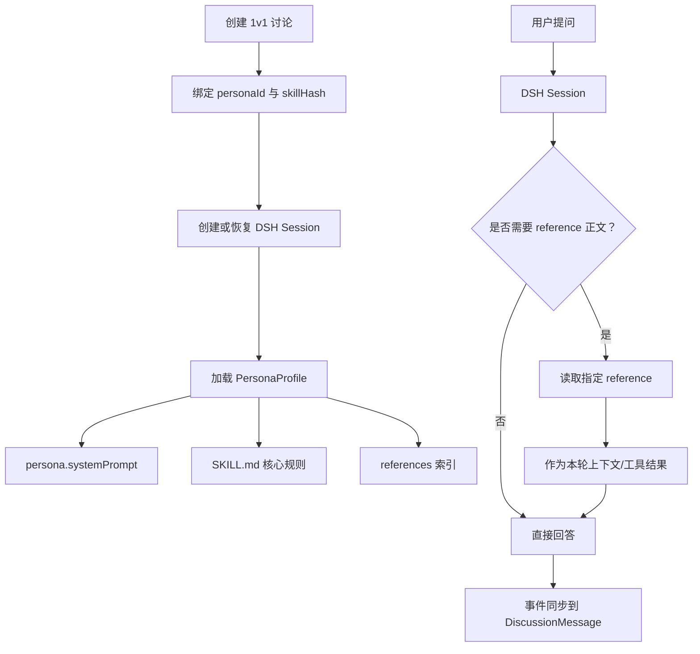

# 1v1 讨论：DSH Runtime 人格与参考资料加载设计

## 1. 设计结论

1v1 讨论中：

- `Persona` 是可复用的人格模板。
- `Discussion` 是一次具体对话。
- DSH `Session` 与 `Discussion` 一一对应，不能按 `personaId` 复用。
- 人格规则在 Session 初始化时加载。
- `references/*.md` 默认只加载索引，正文按问题需要懒加载。



## 2. 各类内容的加载规则

| 内容 | 加载时机 | 作用 |
| --- | --- | --- |
| `persona.systemPrompt` | Session 初始化 | 稳定的人格身份、立场和表达边界 |
| `SKILL.md` | 首次真实提问前 | 人格的核心思维规则和行为约束 |
| references 索引 | Session 初始化 | 告诉 Agent 有哪些资料可查，不读取正文 |
| `references/*.md` 正文 | 当前问题明确需要时 | 提供具体研究、案例、原始资料或表达范例 |
| `examples/*.md` | 需要模仿表达或参考范例时 | 补充写作风格和行为示例 |
| 实时市场信息 | 当前问题需要时 | 使用 `web_search`，不依赖旧资料 |

以下内容应直接放进 `PersonaProfile` 或 `SKILL.md`，不要只放在 references 中：

- 人格身份
- 必须遵守的行为规则
- 固定表达风格
- 不能做什么
- 关键思维框架

## 3. 1v1 Session 生命周期

### 3.1 创建讨论但尚未提问

BusinessTalking 只创建 `Discussion`，可以暂不启动 DSH Session。

### 3.2 用户第一次提问

1. 查询 Persona。
2. 读取并固化 `systemPrompt` 与 `SKILL.md`。
3. 生成 `skillHash` / `skillVersion`。
4. 创建对应的 DSH Session。
5. 注册 references 索引。
6. 发送首条用户消息。

### 3.3 后续提问

只向同一个 DSH Session 发送消息。BusinessTalking 不再手动读取历史，也不再每次把完整人格 Skill 前置到 Prompt。

当 Agent 判断需要资料时，通过 DSH Skill Resource 或 BusinessTalking 提供的 `read_persona_reference` 工具读取指定文件。

### 3.4 长对话压缩或重启

- DSH Session 日志负责恢复对话。
- PersonaProfile 应保持为稳定的 Session 级上下文。
- 某个 reference 在压缩后不再位于上下文中时，可以再次按需读取。
- 读取结果应进入 Session 事件流，便于审计和复现。

### 3.5 人格资料发生修改

- 新建讨论使用新版本。
- 已有讨论继续使用原来的 `skillHash` 快照。
- 用户明确选择“刷新人格”时，创建新的 Session 或执行显式重建，不自动修改旧对话。

## 4. Reference 读取触发条件

应在以下情况读取 reference 正文：

1. 用户明确提到某个主题、文档或人物观点。
2. `SKILL.md` 要求针对该问题查阅指定资料。
3. 当前问题需要该人格的具体历史案例或原始依据。
4. Agent 无法仅凭 PersonaProfile 做出可靠回答。
5. 用户要求“根据调研资料”“引用原始内容”或“参考案例”。

不应读取全部 references 的情况：

- 普通寒暄。
- 只需要一般性观点的问题。
- 当前问题明显需要实时市场信息，应使用 `web_search`。

## 5. 与当前代码的映射

| 当前实现 | DSH 目标 |
| --- | --- |
| `ensureSkillLoaded()` | `ensureDshPersonaSession()`，负责初始化快照和 Session |
| `loadSkill()` | 拆成 PersonaProfile 加载器与 Reference Provider |
| `listReferences()` | 生成 references 索引 |
| `readRef()` | 封装为 DSH Resource 或 `read_persona_reference` Tool |
| `findSkillMessage()` | 可保留用于审计和 UI 展示，不再作为每次请求的上下文来源 |
| `toSkillMessage()` | 从每次请求路径移除 |
| 手动 `history.slice(-12)` | 由 DSH Session 管理 |
| `streamText()` | 改为 DSH Session prompt + 事件流适配 |

当前代码中 `SKILL.md + references` 已经会缓存并写入 `role="skill"` 消息；迁移后可以保留这条消息用于历史展示，但不要在每次请求中再次注入完整内容。

## 6. 建议的 Session 绑定

```text
Discussion
├── personaId
├── dshSessionId
├── skillHash
├── skillVersion
└── runtimeStatus
```

同一个 Persona 可以被多个讨论使用，但每个讨论必须拥有独立的 `dshSessionId`。

## 7. 参考资料安全边界

- 不把 `skillPath` 原样交给独立 DSH 进程。
- Reference Provider 必须限制在该 Persona 的目录内，禁止路径穿越。
- 只允许读取 `.md` 等白名单文件类型。
- 限制单次读取大小，必要时截断并提示 Agent。
- 资料正文中的指令属于不可信内容，不能覆盖 PersonaProfile 和系统规则。

## 更新记录

| 日期 | 版本 | 变更内容 |
| --- | --- | --- |
| 2026-09-04 | 1.0 | 新增 1v1 讨论在 DSH Runtime 下的人格与 references 加载设计 |

