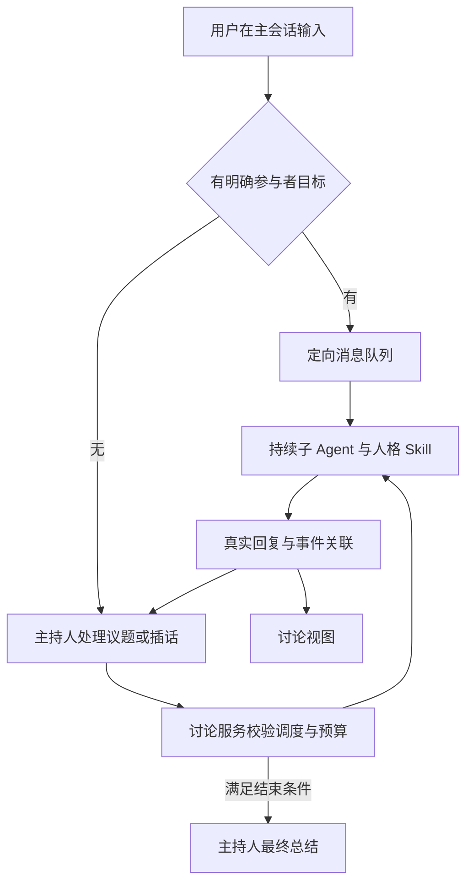
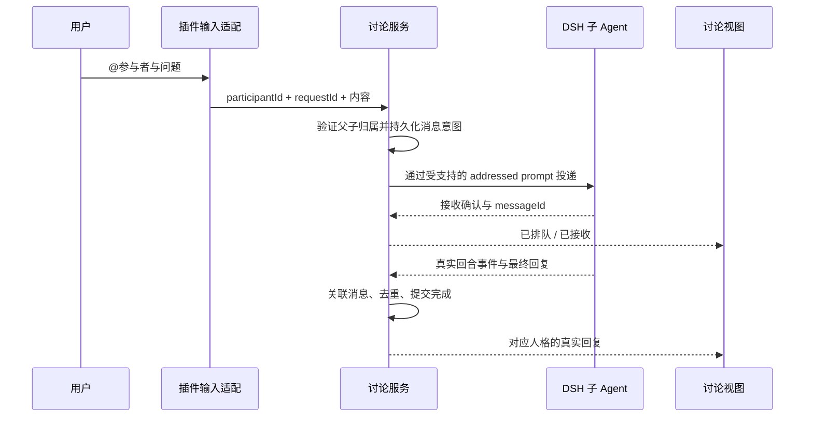
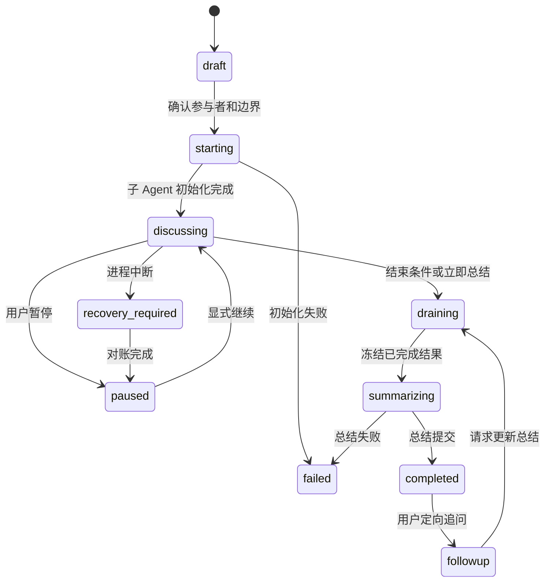

# BusinessTalking DSH 插件完整方案

版本：v1 设计稿 · 2026-09-09。用户已确认采用原生子 Agent 交互与确定性 @ 投递；本文设计其完整实现边界，尚未开始插件开发，也不代表兼容性与稳定性已验收。

## 1. 产品决策与范围

| 项目 | 设计 |
| --- | --- |
| 产品形态 | 一个可安装的 BusinessTalking 插件包，包含 Host 服务、Client 界面和人格 Skill 资源 |
| 人格库入口 | 原生左侧底部追加“人格库”；点击后暂时覆盖 conversation；返回会话时撤销覆盖 |
| 单人聊天 | 原生输入框左下角“＋ → 人格库”选择人格，在当前 Session 加载人格 Skill |
| 多人讨论 | 一个主 Session 组织讨论，每个人格是同一主 Agent 的 continuable 子 Agent；侧栏仍只显示主 Session |
| 讨论方式 | 独立首发后自由追问，主持人选择讨论方向，程序执行硬边界，最后总结 |
| 定向追问 | 主 Session 中选择 @参与者，插件按稳定 ID 投递给指定子 Agent，不让模型猜目标 |
| 可见性 | 主界面的定向追问是公开讨论，主持人可引用；进入子会话称为“单独追问”，不承诺对主持人保密；是否纳入公开时间线与主持人是否收到通知分开处理 |
| 原生复用 | 工作区列表、单会话聊天、子 Agent 目录与详情、模型/凭据、Session 日志和基础生命周期 |
| 不做的变更 | 不替换工作区列表，不用一次性子 Agent冒充持续人格，不依赖实验 Agent Teams，不使用无续跑能力的 Workflow 代替讨论状态机 |

**建议默认值，尚非用户确认参数：**每场 2～5 位人格，默认 3 位，并发 3；每人 1 次首发、之后自动追加发言最多 6 次；活动运行最长 15 分钟；单场自动化活动最多 30 次实际模型请求，其中最后 2 次额度保留给总结。工具续步、主持人和子 Agent 请求均计数。模型消耗无法计量时不得宣称硬预算生效，需通过准入验证或明确阻塞启动。

持续人格绑定也是本稿建议：选中后持续有效，直到用户取消或切换；不把仅一次 slash 注入作为持续绑定保证。所有默认值集中配置，不散落在提示词中。

## 2. 完整界面与用户流程

| 页面/入口 | 插槽或原生能力 | 行为与状态 |
| --- | --- | --- |
| 底部人格库 | sidebar.footer.action | root 级菜单；无当前会话时也可进入 |
| 人格库整页 | conversation 临时优先注册 | 人格搜索、分类、详情、编辑、删除、Skill 版本、选人发起讨论；保留原生注册，离开时只撤销自己的覆盖 |
| 聊天“＋” | conversation.input.left | 自建菜单，含“选择人格”和“发起多人讨论”；不替换原生输入框 |
| 人格选择面板 | 插件弹层 | 单选用于单聊，多选用于创建讨论；共用人格库数据 |
| 当前人格/输入目标 | conversation.input.dock | 显示“当前人格 X”或“公开追问 X”，提供取消与切换 |
| 多人讨论总览 | conversation.view | 一条按事件推进的讨论时间线，按人标识发言，不强制固定轮次；与原生 Chat 并存 |
| 讨论控制 | conversation.session.header.actions / utilities | 状态、预算、暂停、继续、立即总结；仅讨论主 Session 显示 |
| 参与者详情 | 原生子 Agent 顶部目录与地址导航 | 阅读真实子会话；显示该场讨论身份，不复制原生侧栏 |

人格库页面关闭时恢复此前主视图或打开选中的 Session。同一 Session 被再次点击也应关闭人格库，不能仅监听 ID 变化。具体导航事件出口是准入项；不得 monkey-patch sessions.open 或捕获页面 DOM 点击代替正式接口。可以提供明确“返回会话”按钮作为额外入口，但不能据此声称“点击原生会话自动返回”已满足。

覆盖 conversation 可能使原聊天组件重新挂载：草稿、滚动位置、未提交附件、审批等待必须分别验收。打开人格库不会主动取消后端回合；全局提示当前讨论运行/需处理状态。单聊未完成的普通原生审批允许返回会话处理。

### 2.1 单人聊天

选择人格 → Host 校验 personaRevisionId → 保存 SessionBinding → 下一次提交前将冻结的人格 Skill 挂到该 Agent 的 scoped context → 原生聊天继续。前端显示版本与生效状态；加载失败保留原绑定并报错，不显示假成功。

人格切换仅在当前回合结束后生效，忙时排队为待切换并允许取消。旧历史不删除，追加切换记录说明新人格从何处生效；取消移除主动人格 section，但如实说明历史里仍包含之前人格内容。该行为不切换整个 agent preset。压缩/恢复后 Host 根据绑定恢复人格 section，不能单靠历史里的第一次 Skill 文本维持身份。

### 2.2 多人讨论

从人格库或“＋”选择参与者、议题、边界与可选只读能力 → 新建专用主 Session（建议默认，避免把单聊历史意外共享给全员）→ 冻结选中人格版本 → 创建 continuable 子 Agent → 验证每个人格 Skill 已加载 → 并发首发 → 主持人按分歧追问 → 达到结束条件后收集已完成结果并总结。

原有单聊发起讨论时只带用户明确选择的议题/上下文，不自动复制整段私有历史。主持人配置专用 preset；人格子 Agent 继承受控配置组合，各自绑定不同 Skill 与角色。人格不依赖切换 preset 实现，子 Agent 不允许继续递归创建人格团队。

## 3. 自由讨论的执行契约

“自由”仅指主持人选择内容与追问对象；程序决定什么时候可执行、是否超出额度及是否重复。

| 阶段 | 主持人职责 | 程序职责 |
| --- | --- | --- |
| 首发 | 给出共同议题与独立分析要求 | 等待首发均 settled，再允许讨论追问；某人失败须显式标记 |
| 讨论 | 选择相关参与者、引用争议、提出明确问题 | 校验目标属于本场、限制并发/次数、保存引用消息 ID |
| 收敛 | 判断无新增信息、问题已回答或需要用户补充 | 拒绝超过硬限制的新自动调度；接受用户暂停/总结 |
| 总结 | 输出共识、分歧、依据、未知事项、下一步 | 只提交本次总结快照对应的真实结果，保留排除/失败参与者 |

主持人通过 BusinessTalking 提供的调度工具表达“追问 X、询问若干人、申请总结”等动作；工具名属于插件自定义契约，不是声称 DSH 已有这些工具。对讨论主 Agent 不开放绕过控制的原生任意 spawn/send 工具；子 Agent 不开放递归 delegation。底层仍调用原生子 Agent 服务。若必须靠未经支持的内部接口才能控制，标记准入失败。

原生子 Agent settlement 可能唤醒主持人：所有由此触发的实际模型请求也必须纳入预算。服务根据持久化阶段拒绝越界调度，并用合法 pre-step/调用准入机制约束阶段外模型启动；具体可否完整拦截属于关键准入项。不能只数自定义工具调用次数，也不能靠提示词保证不超限。

暂停先停止新自动派发，等待当前回合结束；“强制停止”另外中断当前回合，明确工具结果可能未知。立即总结进入 draining，等待在途工作在限定时间内结束，超时中断并标记未完成；冻结摘要输入水位后才启动总结。迟到结果保留但不悄悄改写已发布总结。

## 4. @参与者的确定性路由

### 4.1 输入规则

| 输入 | 处理 |
| --- | --- |
| 从菜单选择参与者 chip，再输入问题 | 定向投递；提交带 discussionId、participantId、requestId，而非仅名称 |
| 手输 @名称 | 唯一匹配时提示确认目标；重名/不存在时阻止发送并让用户选择 |
| 普通句子提到某个人格 | 普通公开插话，不自动路由 |
| 同时选择多个定向目标 | v1 一条消息只允许一个目标，提示拆分；多目标批量提问可后续扩展 |
| 已结束讨论中 @某人 | 开始显式“追问阶段”，使用剩余额度或用户确认的新额度；旧总结保留并标记有后续内容 |

与原生 @文件/@会话共存：只处理具有插件类型和稳定参与者 ID 的 token；其他引用沿用原生行为。发送拦截必须终止该次原生默认提交，避免同时送给主持人与子 Agent。输入在发送前后保留目标 chip，失败可按同一 requestId 重试。

### 4.2 投递与回复

忙碌子 Agent 的公开定向追问应进入 FIFO 独立回合，不插进正在回答的另一问题。已核对 subagents 的公开 Remote prompt：校验直接父 Agent 必须 live，将 requestId 保存为来源 rpcId，并以 queue 模式调用 Host 投递，返回 messageId。不得直接调用符号私有 deliverSubagentPrompt。外部插件的正式导出/Remote 装配与运行期关联仍需验证。

输入层已找到 CommandClaim.submit 与结构化 ReferenceInsert 两类契约。候选设计是在选择人格时认领一次定向提交，而不是把 reference 文本当路由；最终须验证原生 @触发源冲突处理、claim 与普通引用共存、回车/点击发送一致性。仅有这两个类型不证明完整输入接管已通过。

send_message 只返回 acceptance，并且采用 Steer，不能直接拿它的返回值当人格回复。完成必须核对真实子 Session 的消息与 turn/end，建立 requestId→原生 messageId→子回合→结果的关联。实现不能只取“该子 Agent 最新一条回复”；若缺乏精确关联能力，就不能宣布支持可靠并行 @追问。

公开定向消息写入业务事件流并进入后续主持人摘要输入。原生 settlement 可能同时传递相同结果，使用来源 ID 去重；不冒充主 Session 的 assistant 事件来写人格发言。原生 Chat 展示真实宿主记录，插件 Discussion view 显示带明确来源的聚合记录。

直接进入子会话发送消息不自动变成插件时间线中的公共发言；只有可与公开派发 ID 对应的回合自动进入该时间线，用户也可主动“提交到讨论”。但是原生 settlement 会向父 Agent传递子 Agent 的结束消息，所以整个产品统一使用“单独追问”，不能称为“私聊”或承诺内容不被主持人获知。隐藏时间线记录不能阻止模型看到原生通知；要求真正隔离时应另开不属于本讨论的普通人格 Session。

## 5. 技术组成与接口

用户安装一个包；内部按 Host/Client 构建两个入口，避免一开始拆成大量互相依赖的发布包。正式包名待实现时确定。

| 模块 | 职责 | 依赖 |
| --- | --- | --- |
| Host persona | 人格 CRUD、不可变 revision、Skill provider、Session 绑定 | DSH scoped context / Skill / system prompt |
| Host discussion | 创建主会话/子 Agent、自由调度、阶段状态、预算、总结 | DSH Session/Agent/subagent 服务 |
| Host routing | @请求校验、队列、关联、去重 | 原生 addressed subagent prompt |
| Host persistence | 业务数据库、消息意图、事件索引、恢复对账 | 插件拥有的本地 SQLite；具体驱动与打包兼容需验证 |
| Host API | 校验过的业务 Remote、错误和事件订阅 | Typert/Gateway 正式贡献与构建 |
| Client library | 底部菜单、整页切换、人格列表与编辑 | slots、正式导航接口 |
| Client conversation | ＋菜单、人格绑定提示、@目标、讨论视图 | 原生输入扩展与 Session hooks |

建议业务 API（均为待实现的插件自有接口）：

| 分组 | 方法 | 关键约束 |
| --- | --- | --- |
| personas | list / get / saveRevision / archive | 历史绑定引用旧 revision，删除不破坏历史 |
| bindings | get / set / clear | 绑定当前真实 Session，检查活动回合 |
| discussions | create / get / list / pause / resume / summarize | 修改带 expectedVersion；所有创建带幂等 requestId |
| messages | submit / getStatus / cancelPending | 服务端验证成员归属；取消仅对未接受消息保证撤回 |
| events | follow(afterSeq) | 业务序列单调、先持久化后通知、断线补齐 |

Session 日志继续由 DSH 保存；插件事件只保存业务事实和必要索引/快照，不再复制完整 token 流。讨论视图通过 DSH 流读取详细过程，通过插件流读取讨论归属与状态。

## 6. 数据模型

| 实体 | 关键字段 | 约束 |
| --- | --- | --- |
| Persona | id、名称、头像、描述、archivedAt | 名称不是路由 ID |
| PersonaRevision | id、personaId、skill 内容/资源位置、hash、createdAt | 不可变，路径受控 |
| SessionBinding | sessionId、revisionId、pendingRevisionId、version | 一个 Session 当前至多一个主动人格 |
| Discussion | id、mainSessionId、topic、status、epoch、version、limits、usage | 主 Session 唯一；epoch 隔离旧运行 |
| Participant | id、discussionId、childSessionId、revisionId、status | 唯一 child 归属，固定直接父 Session |
| Dispatch | requestId、目标、内容、来源、status、nativeMessageId、nativeTurnRef、epoch | requestId 唯一；未知投递不可盲重试 |
| DiscussionEvent | discussionId、seq、type、sourceSessionId、sourceSeq、payload | 来源唯一去重；只保留必要数据 |
| Summary | id、discussionId、inputWatermark、来源消息集合、正文、status | 新摘要新版本，保留旧摘要 |
| CapabilityPolicy | discussionId、允许的只读能力、确认时间、版本 | 创建子 Agent 前冻结，不能动态越权 |

预算的模型请求计数需在实际请求入口原子预留，避免并发超限；结束时记录实际用量。业务数据库和 DSH 日志无跨库原子事务，应采用意图记录与恢复对账。

## 7. 状态、恢复与错误

| 情况 | 行为 |
| --- | --- |
| Skill 缺失/加载错误 | 阻止该人格开始；保留根因，允许移除或修复后重试 |
| 单人格失败 | 显示失败并继续其他人；总结注明缺席，不伪造观点 |
| 全部人格失败 | 讨论失败；只显示诊断，不请求模型编造业务总结 |
| 父 Agent 不可用 | 定向投递阻塞并提示恢复主会话；不偷偷创建新父子关系 |
| 发送前失败 | 保存 failed，可按同一 requestId 重试 |
| 接受后无持久化证据即崩溃 | delivery_unknown；让用户选择重新投递，不宣称未发送 |
| 子结果已保存、业务状态未提交 | 用原生来源 ID 对账并补提交，不重新调用模型 |
| 主持人总结失败 | 保留参与者结果与输入快照，显式重试总结 |
| 插件卸载 | 停止新派发，撤销 UI/事件注册；只关闭本插件持有资源，保留历史数据 |
| 数据格式不兼容 | 明确拒绝启动相关功能，提供备份/迁移路径，不静默重置 |

重启不自动继续消耗模型额度：先恢复父子描述、人格绑定和业务事件，重建实际已完成任务，对未知状态标注后进入 paused。用户继续后再启动。DSH 没有 durable parent mailbox，已接受但未落日志的消息可能丢失；不得承诺任意故障下 exactly-once。

错误至少保留阶段、discussion/session/request/turn 标识、原生 code/message、存在的 stack、最后事件与时间。只落脱敏数据，不保存凭据。UI 的“失败”须可打开诊断，不再统一显示“空回复”。

## 8. 搜索、权限与原生子 Agent 限制

DSH 当前子 Agent 权限在启动时固定，需要额外审批的动作会拒绝。该方案不能沿用“讨论中每个子 Agent 随时弹审批”的假设。

建议 v1 默认仅人格 Skill/reference，不联网。用户可在创建讨论时明确选择框架支持的只读搜索权限，所有子 Agent 在受支持权限范围内创建；若原生机制不能在该范围执行搜索，明确显示不可用，不能绕过原生审批。讨论中新增权限应走新授权活动/重新创建受控子 Agent 的显式流程，不偷偷扩大现有子 Agent 权限。

这与旧 baseline 的 A01/A02“运行中讨论级审批共享”不同：新版设计将其改为“启动前能力确认、子 Agent 权限边界与拒绝可见”。此为设计建议和明确差异，不能把旧用例标为通过；若用户要求保留动态审批，须作为额外准入条件解决后再定版。

## 9. 全部 BusinessTalking 功能的去向

| 功能 | 插件中的位置 | 迁移策略 |
| --- | --- | --- |
| 人格、单聊、多人讨论 | 本方案主体 | 以新版事件/绑定模型适配 |
| Skill 导入与版本 | 人格库/技能管理子页＋Host 导入服务 | 保留确认、日志、revision，不直接开放任意模型执行安装命令 |
| 配方编辑与执行 | 人格库入口下的业务导航可扩展独立页面 | 保留 Recipe/Run 数据与可靠调度，不误用原生 Workflow 的无恢复执行 |
| 报告、评分、历史 | 讨论视图结果区与历史页 | 保留实体与导出逻辑，对接新的消息来源 |
| 模型设置 | 原生模型与凭据设置 | 避免第二套凭据表；只保存业务选择引用 |
| 旧讨论记录 | 只读历史导入/查看 | 不假造原生子 Agent lineage；继续旧讨论需明确创建新活动并引用旧摘要 |

实现可以分批交付，但架构审查覆盖全部范围。既有数据迁移必须先做映射、备份和只读核验，不能为了演示直接替换当前数据库。

## 10. 开发前必须闭合的准入项

| ID | 关键证据 | 未满足的处理 |
| --- | --- | --- |
| G1 | 独立发布包可构建加载 Host/Client/Typert，并在固定 DSH 版本运行 | 不以源码仓库内运行代替独立插件兼容 |
| G2 | conversation 覆盖/恢复及同 Session 导航点击可通过正式接口处理 | 明确具体扩展缺口，不以 DOM 注入/私有 monkey-patch 绕过 |
| G3 | @提交可确定性拦截；公开 subagent prompt 能排队，具备回复归属证据 | 不用原生文本 @ 或 send_message acceptance 冒充定向问答完成 |
| G4 | 持续人格绑定在子 Agent 创建、冷恢复、压缩后稳定，且权限受控 | 不以每次换新 Session 绕过 |
| G5 | 主持人自动唤醒、子模型续步均可计量和受预算/阶段约束 | 不宣称有硬边界；需补正式扩展点或调整架构 |
| G6 | 公开与单独子会话消息传播路径明确，不漏进公共摘要 | 根据真实机制确定文案与隔离，不能承诺不存在的私密性 |

以上对完整方案进行集中验证，通过后才进入产品实现。不是先开发最小人格插件，再假定多人也能承载。

## 11. 验收用例

| 分组 | 验收 | 必须证据 |
| --- | --- | --- |
| 人格库 | 底部入口、整页、返回不同/相同会话；无 Session 进入 | 浏览器操作、草稿/附件/视图状态前后对照 |
| 单聊 | 加载 Skill、连续 5 次、切换/取消、刷新、重启 | Session ID 稳定、冻结版本、生效记录、真实回复 |
| 子 Agent | 三人首发、自由追问、查看原生子会话 | 稳定 childId、真实来源、侧栏无子会话重复行 |
| @路由 | 唯一目标、重名、忙时排队、快速连发、失败重试 | requestId/messageId/turn 关联，无重复送主持人 |
| 身份 | 发言显示正确人格，公开/单独追问行为符合实际 | 数据来源与界面身份一致，无主模型伪造子回复 |
| 边界 | 调用/时间/发言上限、暂停、立即总结 | 实际请求计数包括唤醒和工具续步，超限不再派发 |
| 总结 | 正常、部分失败、全失败、迟到结果、追问后更新 | 输入水位和引用消息完整；旧摘要不被覆盖 |
| 恢复 | 父 Agent 冷恢复、接受消息时崩溃、结果落库后崩溃 | 无静默丢消息、无未知结果自动重复调用 |
| 权限 | 无搜索、启动时允许搜索、子 Agent 越权请求 | 有效策略与真实执行一致，拒绝有明确提示 |
| 安装 | 干净安装、重启、升级回滚、卸载再装 | 不改 DSH 核心，数据保留、无重复注册 |

旧 baseline 保留作为当前架构测试资产；未来建立插件 baseline，逐项标注“保留行为/替换实现断言/需求已变更”。本稿不修改旧 prompt.md、不启动原研发 loop。

## 12. 证据与后续交付

- [完整承载审查](G:/claude_project/code-agent/business-talking/docs/plan/dsh-plugin-capacity-review.md)：基础能力、版本与源码范围限制。
- [原生子 Agent UI](G:/claude_project/code-agent/deepseek-harness/packages/client/ui-subagent/README.md)：侧栏隐藏、父会话入口、原生 @ 不路由。
- [子 Agent 生命周期](G:/claude_project/code-agent/deepseek-harness/packages/subagent/subagent/README.md)：continuable、权限和恢复限制。
- [控制工具](G:/claude_project/code-agent/deepseek-harness/packages/subagent/tool-subagent-control/README.md)：send_message 为 acceptance/Steer。
- [公开 prompt 入口](G:/claude_project/code-agent/deepseek-harness/packages/subagent/subagent/src/index.ts:413)：受校验的定向子 Agent 投递；与内部符号方法区分。
- [输入认领契约](G:/claude_project/code-agent/deepseek-harness/packages/client/ui-conversation/src/client/contract/input.ts:36)：CommandClaim 与结构化引用，不将纯文本 @当作确定性路由。
- [插槽优先级](G:/claude_project/code-agent/deepseek-harness/packages/client/ui-slots/src/index.ts:749)：临时覆盖与撤销机制。

定版后交付应包括：接口兼容性结论、插件开发计划、数据迁移映射、更新后的插件 baseline、固定版本安装说明。实现顺序按依赖组织：先闭合全部准入项，再业务契约/存储，再界面与生命周期接入，最后完整真实验收；不把本设计稿等同于已批准迁移当前应用。
