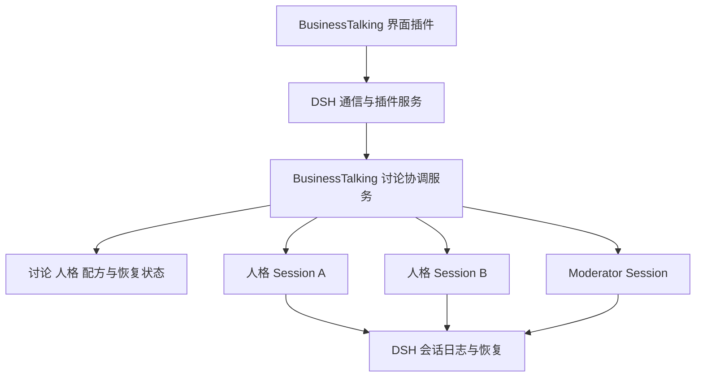

# DSH 对 BusinessTalking 的完整功能承载审查

审查日期：2026-09-09。性质：源码与接口审查；未开发插件、未迁移数据、未运行真实模型验收。

## 1. 决策结论

**DSH 的插件架构具有承载 BusinessTalking 核心业务的扩展机制，但不是现成的、已验证的多人讨论应用框架。当前结论为“架构上有条件可承载，整体迁移尚未通过工程准入”。**

已找到人格作用域、会话创建/恢复/提交、Skill provider、界面 Slot、业务服务与通信扩展的具体入口；没有发现必须修改 DSH 核心才能表达现有业务的决定性障碍。但是，完整多人讨论视图和跨 Session 审批的组合效果、独立包构建安装兼容性尚未验证，不能将“未发现障碍”写成“全部功能已确认可直接迁移”。

如果要求是“通过插件实现我们自己的讨论业务，复用 DSH 的 Agent 与单会话基础设施”，这个方向成立。如果要求是“迁移后无需自己维护讨论恢复、跨人格授权、轮次与幂等”，当前框架不满足。

本报告不以先开发单人插件作为判断依据。先列出完整能力、约束与责任；仅对静态源码无法证明的决定性组合提出定向验证，不启动功能开发。

## 2. 证据范围与版本限制

| 项目 | 已核对内容 | 限制 |
| --- | --- | --- |
| BusinessTalking | 当前 API 路由、Prisma 实体、DSH 插件与编排文件；docs/testing/baseline.md；旧 PRD | 旧 PRD 的多人讨论描述不完整，以当前业务代码和 baseline 补充；存在路由不等于已通过验收 |
| DSH 本地源码 | G:/claude_project/code-agent/deepseek-harness；package.json 为 0.1.2-rc.1；HEAD 指向 master，ref 文件值为 76fda729799fe9b3848dbe2c211d4b231032b81e | Git 因目录所有权检查拒绝状态查询；该值来自只读 ref，不代表已确认工作树干净。未修改 Git 全局信任设置 |
| 当前安装 DSH | BusinessTalking 的 package.json 和 node_modules/@deepseek-ai/dsh/package.json 均为 0.1.2-rc.1 | 相同版本字符串不证明本地源码与发布包逐文件一致；不可把源码已有能力直接当成已安装产物已验证能力 |
| 官方线上材料 | 交叉核对 ui-layout、session-controller、experimental 官方仓库页面 | master 可变；主要依据仍为本次本地阅读的具体文件，非长期稳定性承诺 |

本次未做压力测试、故障注入、发布包构建、重启验收或历史数据迁移试验。下表“原生”指存在明确机制，不表示 baseline 已通过。

## 3. 判断标记

| 标记 | 含义 |
| --- | --- |
| 原生 | 已找到直接对应的公开服务或扩展契约，可以作为复用基础 |
| 业务插件 | 已有合适入口，但具体业务规则、状态与界面仍由 BusinessTalking 实现 |
| 条件成立 | 部分机制明确，关键组合或发布兼容性缺少验证；不能直接签署迁移通过 |
| 原生不满足 | 现成机制明确不覆盖需求；可另写业务插件，不等于一定要改核心 |

“必须改核心”需要正面证据，不能因暂时未找到 API 就下结论；本次没有确认任何现有业务必然要求改核心。

## 4. 单人讨论承载表

| 功能 | 判断 | DSH 承载入口 | BusinessTalking 仍需负责 | 约束 / baseline |
| --- | --- | --- | --- | --- |
| 人格列表、头像、编辑、删除 | 业务插件 | Host 服务＋Client Slot [E1][E2] | 人格库、素材、校验、CRUD 和删除引用策略 | 人格不是一个普通 preset 名称就能涵盖 |
| 人格提示词与工具隔离 | 原生＋业务插件 | Agent scoped context；preset；Skill scope [E3][E4] | 冻结人格版本、初始化与恢复时挂载正确作用域 | 已有对话不能随意换 preset；子 Agent 默认继承父 composition，不能据此假设天然不同人格 |
| 第一次提问、连续多轮 | 原生 | sessionController.create/prompt；Agent followup/steer [E5] | 将选定人格与稳定 Session 绑定 | prompt 返回接收确认，不是最终结果；须等事件判定完成。B01–B03 |
| 刷新与关闭后续聊 | 原生 | Session history/follow 与客户端事件流 [E5] | 正确保存讨论入口与 Session 关联 | 原生传输恢复不等于业务错误自动恢复。B04/O01 |
| 重启后续聊 | 原生＋业务插件 | Agent resume＋Session persistence [E6] | 恢复人格快照与所属讨论，不重复初始化 | 单 Session 修复不保证插件上下文无 bug。B05 |
| 多个单人讨论隔离 | 原生＋业务插件 | 独立 Session、preset/scoped 注册 [E3][E4][E5] | discussion→session 映射、隔离数据访问 | 同人格也不得共享一个聊天 Session。B06 |
| Skill 调用与 reference | 原生＋业务插件 | skills.registerProvider；原生 Skill loader [E4] | revision 冻结、白名单、reference 路径和只读 guard | 不应简单开放全局 filesystem provider 替代当前隔离。S01/S02/S04 |
| 重复提交、失败提示与继续 | 业务插件 | Session 队列/取消、原生错误事件 [E5][E6] | 保持当前冲突处理和重试契约；保留原始错误 | 原生 followup 可能入队，不能假设与现有“忙时拒绝”完全相同。X02/O02–O04 |

## 5. 多人讨论承载表

| 功能 | 判断 | DSH 承载入口 | BusinessTalking 仍需负责 | 约束 / baseline |
| --- | --- | --- | --- | --- |
| N 个人格独立运行 | 原生＋业务插件 | Session/Agent 创建服务，可组成不同会话 [E3][E5] | 创建 N 个普通人格 Session，设定并发上限和关联 | 不以实验 Agent Teams 为依赖。B07/B09/X01 |
| 同轮并行、轮间串行 | 业务插件 | 多 Session 提交＋事件观察 [E5] | 同轮输入快照、结果收集、屏障、超时和并发队列 | Cordis 不自动提供讨论调度器。B08/X01 |
| 主持人汇总与多轮推进 | 业务插件 | 独立稳定 Moderator Session [E5] | 结构化输出校验、成功消息集合、轮次提交 | 无真实发言不能生成共识；保持 F01/F02 |
| 跨人格与跨轮上下文 | 业务插件 | 每个 Session 的独立历史与输入注入 | 精选其他人格发言、去重、状态版本和插话消费 | 独立 Session 不自动共享其他人格的历史。B08/X03 |
| 多人各自调用 Skill | 原生＋业务插件 | 每个 Agent 的 Skill scope [E4] | 逐人格 revision/allowlist 与事件归属 | “一个人调用成功”不能代表全员。S03 |
| 讨论级批准/拒绝 | 条件成立 | approval/request 的 scoped waterfall [E7] | discussion×capability 授权表、并发请求合并、逐次审计与取消 | 原生只授权一次动作；不能按监听注册先后抢答。A01/A02 |
| 单人格失败与重试 | 业务插件 | 各 Session 独立状态、提交与取消 [E5] | attempt、故障分类、局部继续、禁止重复提交 | 基础设施故障和正常 Persona 回合失败须区分。F01/F02/X04 |
| 归档、恢复、终止讨论 | 业务插件 | Session 取消/恢复＋插件存储 [E5][E6] | 讨论级停止、run lease、旧 run 禁止提交、恢复策略 | 停一个 Session 不等于停完整讨论。X05 |
| 重启续跑与结果一致性 | 原生不满足，须业务插件 | Session 日志可恢复 [E6]；Workflow 明确无检查点 [E8] | 持久化轮次、收集结果、恢复任务、幂等提交与崩溃对账 | 不可直接把现有 orchestrator 换为 workflow 工具并宣称解决恢复 |
| 同屏显示多人过程与审批 | 条件成立 | conversation.view、composer chain、uiSession、业务 Remote [E1][E2][E7] | 多 Session 汇总视图、发言身份、待审批集合和输入路由 | 原生插槽以 Session 为作用域；完整多人组合须验证，不能承诺原聊天 UI 零改造复用 |

## 6. 其他现有功能承载表

为避免遗漏，这里覆盖当前路由、数据实体及 PRD 中的配套功能；不将其存在误写为已实现质量保证。

| 功能 | 判断 | 承载方式 | 必须保留的业务责任 |
| --- | --- | --- | --- |
| Skill 库、安装导入、版本 | 业务插件 | Host 文件/数据服务＋Client 管理页＋Skill provider | 导入确认、执行日志、失败重试、revision、来源与路径校验；原生 Skill loader 不等于安装管理系统 |
| 配方 CRUD、复制、步骤编辑 | 业务插件 | 插件业务存储＋管理界面 | Recipe/RecipeStep、输入传递和编辑校验 |
| 配方执行、跳过、重试 | 业务插件 | 调用原生 Agent，业务调度持久化 | Run/RunStep、逐步结果和恢复；不能依赖无恢复能力的 Workflow 替代 |
| 报告、导出、评分与历史 | 业务插件 | 业务数据/API/页面，可借用原生文件展示 | Artifact/Feedback、报告结构、Markdown 导出、筛选和引用关系 |
| 附件与文本提取 | 原生＋业务插件 | 原生支持附件提交 [E5]，自有解析服务 | 当前文档类型、长度/截断提示及元数据；不把图片附件支持等同于所有文档解析 |
| 模型设置、凭据与连接测试 | 原生＋业务插件 | 原生模型选择与服务路由 [E5] | 迁移时确认当前 provider/model 行为兼容；不复制密钥到插件日志 |
| 数据库与已有历史迁移 | 条件成立 | Host 插件可自持数据库，DSH 日志保持其格式 [E6] | schema 迁移、旧 ID 映射、备份/回滚、历史只读兼容；不能直接把 Prisma 消息表当原生 Session 日志 |
| 独立安装、升级、卸载 | 条件成立 | Cordis Loader＋dsh.client＋Typert 发布产物 [E9] | 构建产物、依赖版本、插件数据迁移、卸载保留策略、重启激活 | 本地源码可加载不等于已证明独立发布包可安装；未验证上游稳定兼容承诺 |

当前讨论使用 DSH，不代表旧配方/会话入口已统一到 DSH。迁移前需要明确每个实际入口的执行后端，不能仅搬 UI 后继续暗用另一条执行链。

## 7. 三个决定性的框架限制

### 7.1 原生 Workflow 不能直接承接可靠讨论恢复

文档明确：执行过程没有 journaling/resume，重启不能继续同一 workflow；也不提供子 Agent token 总预算语义。[E8]

因此要保留讨论协调服务与其持久化状态。DSH 保存单个 Session 日志；业务服务保存“哪一轮已提交、哪位人格已完成、下一步是否启动 Moderator”。两套状态之间需要持久化屏障、幂等关联和恢复对账，没有跨两者的自动事务保证。框架具备 flush 等基础能力，不会自动替业务解决这个问题。

### 7.2 共享审批是新增业务语义

原生 ApprovalService 只返回 allowed-once/rejected/cancelled/unavailable。ask/never 是会话策略，never 会在 answerer 之前拒绝。[E7]

插件可以利用作用域 waterfall 实现讨论授权，但必须明确唯一决策责任：未决定时交给指定 UI；决定后逐次记录对应动作；不同讨论隔离；并发申请共享一次用户决定但各自安全结束。不能简单全局批准，也不能假设原生审批组件自动收集所有后台 Persona 的问题。

### 7.3 可以扩展 WebUI，但整页替换会影响原生复用

ui-layout 源码明确说明：替换 conversation 主区域会移除原 ConversationRoot 声明的子插槽；侧栏也有相同边界。[E1]

已有 conversation.view 是 additive list，可以作为讨论视图候选；但其 scope 仍是单个 Session，输入与审批也有 Session 归属。现有代码证明可以挂自定义视图，尚未证明完整的多会话输入/审批聚合可以在不侵入内部组件的情况下完成。不能通过深导入未导出的 AppFrame/ConversationRoot 来冒充公开扩展。

## 8. 责任边界与迁移收益

| 有机会减少的维护 | 仍不能消失的维护 |
| --- | --- |
| Next→自建 runner→DSH 的进程/通信适配 | 多人格轮次编排、失败分类与稳定结果关联 |
| 单 Session 事件传输、历史分页和重连实现 | 跨 Session 汇总事件与业务状态恢复 |
| 标准单聊、工具展示、模型配置的重复界面 | 人格/Skill 版本、讨论权限与多人界面 |
| 原有 HTTP 审批桥的部分职责 | 讨论级授权语义及其并发一致性 |

Host 内直接调用 DSH 服务会减少一段边界，但也把插件和其他 Session 放进共享 Host 故障域。插件阻塞、泄漏或进程崩溃可能影响其他对话；当前独立 runner 的隔离优势会变化。不能只计减少的代码，不计故障隔离变化。

## 9. 工程准入：只验证尚未闭合的整体关键点

这些是决定“要不要迁移”的条件，不是先开发小插件的路线图。当前未执行，状态均为待验证。

| 编号 | 必须得到的证据 | 不满足时的决策 |
| --- | --- | --- |
| G1 发布兼容 | 针对明确 DSH 产物版本，外部包能构建/装载 Host、Client 和自定义 Remote，无需改上游源文件 | 若只能绑源码私有路径，不能认定独立可维护插件方案通过 |
| G2 完整讨论 UI | 多 Session 视图、统一输入、后台人格审批可通过公开接口协作；切换、刷新时归属正确 | 若必须复制大片内部聊天/审批代码，重新评估迁移收益；如需核心补点，先列精确缺口 |
| G3 授权范围 | 一个讨论多请求共用一次选择，审计完整，另一个讨论不继承，取消/重启策略明确 | 如只能全局放权或覆盖原生策略，该方案不通过 |
| G4 一致性恢复 | 明确“结果已写 Session、业务轮次未提交”及反向边界的恢复算法和幂等键；无重复模型执行/伪成功 | 不允许用新建 Session 或反复自动重试掩盖问题 |
| G5 现有故障归属 | 相同人格/Skill 与 Session 复用条件下保留原始异常，区分接入层与 DSH/插件生命周期问题 | 若仍是原 scoped hook 缺陷，迁移不是其修复依据 |

G4 的“不重复模型执行”以已存在可确认成功结果时不重复执行为准；对崩溃时模型请求结果未知的情况，必须明确展示未知并采用显式恢复策略，不能承诺任意网络/崩溃条件下 exactly-once。

现有 baseline 的功能验收可作为未来迁移前后对照；A/B/C 层里与当前 Next/runner 绑定的实现断言需映射到新边界，但不得削弱用户可见行为。本次不修改 baseline 或 loop 提示词，不启动迁移。

## 10. 证据索引

下列本地路径是本次审查来源，不是要求插件深导入这些内部源码。能作为正式依赖的 export 仍须 G1 核对。

| 索引 | 源码 / 文档 | 支持的结论 |
| --- | --- | --- |
| E1 | [ui-layout](G:/claude_project/code-agent/deepseek-harness/packages/client/ui-layout/src/client/index.ts:39)、[conversation slots](G:/claude_project/code-agent/deepseek-harness/packages/client/ui-conversation/src/client/contract/slots.ts:117) | 主区域替换会移除子插槽；conversation.view 与 composer 的形态/作用域 |
| E2 | [ViewRegistry](G:/claude_project/code-agent/deepseek-harness/packages/client/ui-conversation/src/client/conversation/view-registry.ts:12)、[UI Slots](G:/claude_project/code-agent/deepseek-harness/packages/client/ui-slots/README.md) | 自定义视图注册及组件扩展契约 |
| E3 | [agent presets](G:/claude_project/code-agent/deepseek-harness/packages/preset/agent-presets/README.md)、[现有人格插件](G:/claude_project/code-agent/business-talking/runtime/dsh-plugin/index.mjs:240) | 多 composition、preset 切换限制、实际 scoped 挂载实现 |
| E4 | [Skill provider](G:/claude_project/code-agent/deepseek-harness/packages/skill/skill/README.md)、[Skill scope](G:/claude_project/code-agent/deepseek-harness/packages/skill/skill/src/index.ts:113) | 自定义 provider 和作用域；原生 registry 不负责业务 revision |
| E5 | [Session Controller](G:/claude_project/code-agent/deepseek-harness/packages/api/session-controller/README.md)、[commands](G:/claude_project/code-agent/deepseek-harness/packages/api/session-controller/src/commands.ts:288)、[Agent create/resume](G:/claude_project/code-agent/deepseek-harness/packages/core/agent-loop/src/index.ts:689) | Session 操作、提交确认、事件恢复；控制快照为进程内状态 |
| E6 | [Session](G:/claude_project/code-agent/deepseek-harness/packages/core/session/README.md)、[Persistence](G:/claude_project/code-agent/deepseek-harness/packages/session/session-persistence/README.md) | 日志、flush、崩溃修复及格式迁移限制 |
| E7 | [ApprovalService](G:/claude_project/code-agent/deepseek-harness/packages/interaction/user-approval/README.md)、[UI approval](G:/claude_project/code-agent/deepseek-harness/packages/client/ui-approval/src/client/index.ts:40) | one-shot、scoped waterfall 与 Session 归属 |
| E8 | [Workflow 限制](G:/claude_project/code-agent/deepseek-harness/packages/workflow/workflow/README.md:120)、[Experimental](G:/claude_project/code-agent/deepseek-harness/packages/experimental/README.md:12) | Workflow 无续跑；Agent Teams 未正式发布，不作为产品依赖依据 |
| E9 | [Client modules](G:/claude_project/code-agent/deepseek-harness/packages/client/modules/README.md)、[Typert generator](G:/claude_project/code-agent/deepseek-harness/packages/typert/generator/README.md)、[Loader](G:/claude_project/code-agent/deepseek-harness/packages/typert/loader/README.md)、[API Remote](G:/claude_project/code-agent/deepseek-harness/packages/api/remotes/README.md) | dsh.client 构建产物、可发布生成物、发现与 Remote 装配 |
| E10 | [Prisma 实体](G:/claude_project/code-agent/business-talking/prisma/schema.prisma)、[原 PRD](G:/claude_project/code-agent/business-talking/docs/prd/01_PRD.md)、[Baseline](G:/claude_project/code-agent/business-talking/docs/testing/baseline.md)、[编排](G:/claude_project/code-agent/business-talking/src/lib/discussion/orchestrator.ts) | 全部业务范围、当前多轮规则与验收要求 |

线上交叉核对：[官方布局源码](https://github.com/deepseek-ai/deepseek-harness/blob/master/packages/client/ui-layout/src/client/index.ts)、[官方 Session Controller](https://github.com/deepseek-ai/deepseek-harness/blob/master/packages/api/session-controller/README.md)、[官方实验模块声明](https://github.com/deepseek-ai/deepseek-harness/blob/master/packages/experimental/README.md)。线上内容仅用于对应机制核对，不提供已安装版本验证。
