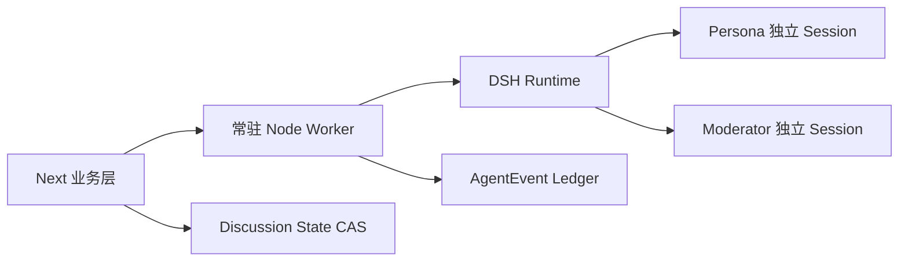

# BusinessTalking DSH Runtime 迁移评审报告

> 评审日期：2026-09-05  
> 评审对象：`docs/plan/dsh-runtime-migration-summary.md` 及其对应实现  
> 对照方案：`docs/plan/dsh-runtime-execution-plan.md`  
> 用途：供后续 AI 或开发者继续修复、验证和验收

## 1. 评审结论

当前实现可以认定为：

> **DSH 调用链跑通的原型，但还不能认定为按执行方案完成迁移。**

独立真实 Node 子进程是合理的环境适配方向，确实解决了 Electron 托管环境下使用 `process.execPath` 启动 DSH 的问题。

但是，当前实现仍存在影响核心正确性的缺口：

- 人格 `SKILL.md`、普通 Skill 与 manifest 没有完整接通；
- 1v1 追问无法可靠继承历史上下文；
- Moderator 没有收到需要汇总的发言正文；
- DSH 失败时存在自动回退和强制完成；
- 实际工具权限没有收敛到只读范围；
- provider、model、baseURL 没有准确传入 DSH；
- 原始事件、重试、版本冻结、用户插话和并发提交仍未闭环。

因此，当前的“有回复、状态为 `done`、30/30 测试通过”不能作为迁移完成的充分条件。

## 2. 已验证的结果

### 2.1 验证通过

- 在隔离的 `DSH_HOME` 下运行 Vitest：`8 files, 30/30 tests passed`。
- TypeScript 检查：`tsc --noEmit --incremental false` 通过。
- 总结文档记录的构建结果为成功：`Compiled successfully`，静态页 `24/24`。
- 总结文档记录的端到端演示能完成 2 轮、2 个人格并生成消息。

### 2.2 验证范围不足

现有测试主要覆盖：

- 纯函数、Prompt 组装和 JSON 提取；
- profile 辅助函数；
- 默认 SDK profile 的组件存在性。

尚未被自动化测试充分覆盖：

- 实际人格 Skill 初始化与普通 Skill 加载；
- references 按需读取和权限隔离；
- 1v1 跨轮追问记忆；
- Moderator 是否收到真实发言内容；
- DSH 进程/协议失败时的错误传播；
- retry 是否使用同一份 `TurnInputSnapshot`；
- 并发状态提交和版本冲突；
- 用户 steer 到下一轮人格输入的完整链路；
- Skill/Persona 修改后旧讨论的版本冻结；
- 归档、恢复和 purge 的真实文件清理。

## 3. 高优先级问题

### P1-01：人格与 Skill 加载链路未完整实现

**影响：高。** 讨论可能得到普通模型回复，但不能证明回复使用了指定人格和 Skill。

具体问题：

1. `scripts/dsh-turn.mjs` 使用显式环境变量白名单，但没有把 `BT_DSH_SESSION_ID`、`BT_INTERNAL_SEARCH_URL`、`BT_INTERNAL_TOKEN` 和项目级 `DSH_HOME` 传入 DSH 子进程。
2. 插件会因为缺少 `BT_DSH_SESSION_ID` 而回退到固定的 `bt-e2e` manifest；项目中该 manifest 可能是旧测试数据。
3. Persona 的 `get()` 返回 `systemPrompt`，没有返回快照中的完整 `SKILL.md` 正文。
4. 普通 Skill 的 `get()` 返回的是“完整 SKILL.md 由 DSH skill tool 按需加载”的占位文本，但当前 provider 没有继续执行真实加载。
5. `buildPersonaManifest()` 只放入 `persona-profile`，没有读取和传入讨论实际选择的普通 Skill allowlist。
6. 插件 provider 注册在 tools/skills 注入上下文，但没有落实方案要求的 per-agent/per-session 隔离。

代码依据：

- `scripts/dsh-turn.mjs:25-29`
- `runtime/dsh-plugin/index.mjs:32-40`
- `runtime/dsh-plugin/index.mjs:139-163`
- `src/lib/discussion/dsh-service.ts:64-84`

建议：

- 子进程环境只做必要白名单，但必须显式传入当前 session、项目级 DSH home 和内部工具所需的短期凭据；
- 初始化阶段 fail-closed 加载 `systemPrompt + Persona SKILL.md`；
- 普通 Skill 必须从已安装、已授权、已固定版本的 Skill Library 读取真实 `SKILL.md`；
- reference 正文继续按需读取，但必须验证 Skill、版本、路径和 hash；
- 增加测试：错误 session、错误 hash、未授权 Skill、缺失 Skill 均必须失败。

### P1-02：每回合新 Session 导致 1v1 上下文丢失

**影响：高。** 当前方案解决了跨新进程复用已完成 Session 返回空的问题，但代价是没有可靠的对话记忆。

`runOneOnOneTurn()` 每次读取当前 Discussion 后重新组装 prompt；prompt 只包含 brief、当前 `discussionState`、人格名称和当前问题，没有读取历史 `DiscussionMessage`，也没有在成功后更新足以承接上下文的结构化状态。

例如：

1. 第一轮用户说“预算只有五万元”；
2. 第二轮用户说“按刚才的预算继续”；
3. 第二轮输入中没有预算信息，也没有可靠的 DSH Session 历史。

代码依据：

- `src/lib/discussion/dsh-service.ts:141-168`
- `src/lib/discussion/dsh-service.ts:303-317`

建议二选一，但必须形成明确契约：

- 使用真正常驻的 Node Worker 和稳定的 participant Session；或
- 明确采用无状态回合，每次从 DB 重建经过裁剪、排序和 token 限制的历史上下文，并保存摘要/事实状态。

“新进程复用 Session 返回空”只能说明当前运行方式存在问题，不能直接证明 DSH Session 永久不可复用。应先检查原始事件中的 turn/end reason、Session 状态和持久化位置。

### P1-03：Moderator 没有收到本轮发言正文

**影响：高。** Moderator 当前拿到的是当前状态和 `acceptedMessageIds`，不是这些消息的实际内容。

当前 prompt 没有查询或插入：

```text
{ messageId, participantId, personaName, content }
```

因此，Moderator 即使输出合法 JSON，也不能证明其总结基于真实发言。只把每个人的前 120 个字符拼成 fallback summary，也不能构成共识、证据或决策。

代码依据：

- `src/lib/discussion/orchestrator.ts:50-70`
- `src/lib/discussion/orchestrator.ts:156-200`
- `src/lib/discussion/orchestrator.ts:238-255`

建议：

- 本轮人格回合全部完成后，从 DB 查询本轮真实消息；
- 将完整消息或经过确定性裁剪的消息包传给 Moderator；
- 显式传入 `stateVersion`、`round`、消息 ID 和参与者 ID；
- 校验 `evidence.sourceMessageIds` 必须引用本轮真实消息；
- Moderator 失败时保留旧状态并报错，不生成伪共识。

### P1-04：自动 AI SDK 回退和强制成功违反已确认约束

**影响：高。** 执行方案已经明确“不得隐式回退到 AI SDK；Runtime/协议失败必须抛错”。当前实现却在 DSH 失败后调用 `runViaAiSdk()`，Moderator 两次失败后还会构造 fallback proposal 并继续把讨论标记为完成。

代码依据：

- `src/lib/discussion/dsh-service.ts:173-196`
- `src/lib/discussion/orchestrator.ts:236-266`
- `docs/plan/dsh-runtime-execution-plan.md:15-26`

总结中提到“可以用 A，我不一定要用 Next 来处理”，只能支持把 DSH 放进独立 Node 进程，不能自动推导出“允许 AI SDK 降级”。这两项授权必须分开记录。

建议：

- DSH 失败直接记录准确错误类型并返回；
- Persona 单回合模型错误可按方案继续其他 Persona；
- Runtime、transport、JSON-RPC、manifest 或协议错误应使整个讨论失败；
- Moderator JSON 校验失败应进入 `paused/failed`，等待显式 retry；
- 不得用截断文本伪造 assistant 消息、共识或成功状态。

### P1-05：工具权限没有收敛到只读范围

**影响：高。** 方案要求第一阶段关闭副作用工具，但合并后的实际 DSH profile 仍能看到 PowerShell、文件系统和编辑工具组件。

当前 patch 只显式关闭了部分工具：

- `tool-bash`
- `tool-goal`
- `tool-todo`
- `tool-workflow`
- `tool-jobs`
- 默认网络工具

但实际配置仍保留 `tool-pwsh`、`tool-fs`、`tool-str-replace-editor` 等可能执行命令或修改文件的工具。`toolPolicy.sideEffects=false` 只是 manifest 中的数据，不等于运行时权限控制。

代码依据：

- `runtime/dsh/cordis.patch.yml:18-35`
- `runtime/dsh-plugin/index.mjs:181-193`

建议：

- 采用显式 allowlist，而不是只关闭几个已知组件；
- 第一阶段只允许人格 Skill、已授权 Skill、`read_skill_reference` 和受控 `web_search`；
- 明确禁用 PowerShell、写文件、编辑文件、子 Agent 和其他外部副作用能力；
- 增加启动后 roster 快照测试，发现未授权工具立即 fail-closed。

### P1-06：provider、model、baseURL 路由映射不正确

**影响：高。** 当前 `resolveDshRoute()` 对非 DeepSeek 场景也返回 `deepseek-official`；`baseURL` 虽然从设置中读取，却没有进入实际 `TurnRequest` 和 DSH 配置。

另外，`buildRuntimePatchYaml()` 生成的配置结构与已安装 `llm-pi-ai` 的 provider 配置结构不一致，而且该函数目前只在测试中使用，未形成生产执行链路。

代码依据：

- `src/lib/runtime/profile.ts:48-75`
- `src/lib/runtime/profile.ts:82-95`
- `src/lib/discussion/dsh-service.ts:251-271`
- `scripts/dsh-turn.mjs:34-40`

建议：

- 从 BusinessTalking 的固定 RuntimeProfile 精确映射 provider、model、baseURL 和 credential env；
- 对 OpenAI-compatible、Anthropic、DeepSeek 分别验证 adapter；
- 不支持的 provider 或路由直接抛出 `DshRouteUnsupportedError`；
- 将最终生效的 route/config 写入 profile 快照并参与 hash；
- 增加“自定义 baseURL 实际被请求”的集成测试。

### P1-07：原始事件、实际 Session ID 和重试链路不一致

**影响：高。** 独立执行器只返回 `finalResponse`，丢弃 DSH 原始 events/notifications；业务层把 `eventsWritten` 固定为 0，并把持久化记录的 Session ID 写成稳定的 participant ID，而实际执行使用的是临时 fresh Session。

此外，正常讨论走 `runTurnViaProcess()`，retry route 却重新走旧的 `DshRuntimeManager` 进程内路径，形成两套不一致的运行时。

代码依据：

- `scripts/dsh-turn.mjs:31-45`
- `src/lib/runtime/turn-process.ts:20-23`
- `src/lib/discussion/dsh-service.ts:199-237`
- `src/app/api/v1/discussions/[id]/participants/[participantId]/retry/route.ts:34-55`

建议：

- 子进程返回经过校验的 events、notifications、实际 sessionId、turn/end reason；
- AgentEvent 与 DiscussionMessage 分开持久化；
- `DiscussionTurn.sessionId` 必须记录真实执行 ID；
- retry 与正常执行必须共用同一条 DSH Worker/Runtime 抽象；
- retry 只能使用失败回合保存的原始 `inputSnapshot`，并创建新的 attempt。

## 4. 重要但次于上述问题的缺口

### P1-08：用户 steer 没有进入多人调度状态

多人 steer API 只创建 `DiscussionMessage`，而 orchestrator 只从 `state.userSteers` 读取 steer。两条数据链路没有接通，因此用户插话可能永远不会进入下一轮人格 Prompt。

依据：

- `src/app/api/v1/discussions/[id]/steer/route.ts:30-34`
- `src/lib/discussion/orchestrator.ts:159-164`

同时，`targetParticipantIds` 与 `personaId` 的语义需要统一，不能混用不同类型的 ID。

### P1-09：状态提交不是真正的原子 CAS

`commitStateProposal()` 先查询并比较版本，再单独执行 `update`。并发请求可能都通过旧版本检查并互相覆盖。Proposal 自带的 `basedOnStateVersion` 和 `round` 也没有完整核验。

依据：`src/lib/discussion/orchestrator.ts:96-136`

建议在数据库事务中使用带条件的更新：

```text
UPDATE Discussion
SET discussionState = ..., stateVersion = stateVersion + 1
WHERE id = ? AND stateVersion = ? AND archivedAt IS NULL AND status = 'running'
```

再依据受影响行数判断是否发生冲突，并在同一事务中写入 Moderator turn 和相关投影。

### P2-01：Persona snapshot 不能保证完整资料包不可变

当前 snapshot hash 主要基于 `SKILL.md`，没有把 `systemPrompt` 和 references 内容整体纳入版本指纹；每次 `ensurePersonaSession()` 都重新读取当前 Persona 并刷新绑定。

这会导致：

- 仅修改 `systemPrompt` 或 reference 时，旧讨论可能无法区分新旧版本；
- 同一 `SKILL.md` hash 下 reference 发生变化时，可能复用旧 snapshot；
- 旧讨论不一定持续使用创建时的 Persona 资料。

依据：

- `src/lib/dsh/snapshot.ts:63-122`
- `src/lib/discussion/dsh-service.ts:89-105`

版本指纹至少应覆盖 `systemPrompt + SKILL.md + references/examples 文件清单与正文 hash`，并在 Discussion/Participant 创建或首次绑定时固定。

### P2-02：归档、恢复和物理清理尚未形成闭环

`runPurge()` 虽然定义了，但没有确认被调度服务调用。清理逻辑还存在以下风险：

- 逻辑标记 participant 为 failed 不等于停止正在运行的任务；
- 清除 manifest 后又依赖 manifest 查找 snapshot；
- 清理路径与实际 DSH 持久化路径可能不一致；
- snapshot 可能被多个讨论共享，不能按单个讨论直接删除；
- 缺少严格的 TTL 和路径边界校验。

依据：`src/lib/discussion/archive.ts:49-128`

## 5. 建议的目标运行结构

独立 Node 进程方向可以保留，但建议将“独立进程”和“每回合新 Runtime/新 Session”拆开，不要把环境适配问题直接固化成无状态架构：



职责建议：

1. Next 只负责 Discussion、Skill/Persona 版本、权限、状态提交和 UI 投影。
2. Node Worker 负责 DSH Runtime 生命周期、Session mutex、事件回传和错误分类。
3. 每个 Participant 使用独立稳定 Session，Moderator 使用独立 Session。
4. DSH Runtime 失败不会自动转 AI SDK。
5. 如果由于当前 DSH 版本无法可靠恢复长 Session，才使用“DB 历史重建”的无状态模式，并将其作为明确架构决策，而不是临时 fallback。

## 6. 推荐修复顺序

### 第一阶段：恢复正确性和安全边界

1. 修正子进程环境、项目级 `DSH_HOME` 和 manifest 绑定。
2. 完整接通 Persona `systemPrompt + SKILL.md`、普通 Skill allowlist 和 reference 读取。
3. 删除自动 AI SDK fallback 和 Moderator 强制成功逻辑。
4. 收敛工具 roster 到显式只读 allowlist。
5. 修正 provider/model/baseURL 的真实路由配置。
6. 让正常执行和 retry 共用同一 DSH Worker 路径。

### 第二阶段：恢复讨论语义

1. 解决 1v1 历史承接：稳定 Session 或 DB 历史重建二选一。
2. 给 Moderator 传递本轮完整消息和严格证据引用。
3. 接通多人 steer。
4. 实现真正的 stateVersion/round CAS 和冲突处理。
5. 持久化真实 AgentEvent、turn reason 和实际 Session ID。

### 第三阶段：版本与运维闭环

1. 完整资料包版本冻结。
2. 统一项目级 DSH 持久化根目录。
3. 接入 purge 调度、运行中任务 drain 和共享 snapshot 引用计数。
4. 增加恢复、归档、清理、重试和并发测试。

## 7. 迁移完成前的验收标准

- [ ] 同一 Persona 在两个 Discussion 中使用不同独立 Session，历史不串线。
- [ ] 同一 Discussion 的 1v1 第二轮能够使用第一轮事实，且重启 Worker 后行为符合既定恢复策略。
- [ ] Persona `systemPrompt` 和 `SKILL.md` 在 Session 初始化时真实生效。
- [ ] 普通 Skill 只能从已安装且已授权的固定版本加载。
- [ ] reference 只在需要时读取，路径、hash、大小和 allowlist 校验失败会报错。
- [ ] 实际 DSH roster 中不存在 PowerShell、写文件、编辑文件等未授权工具。
- [ ] Moderator 收到本轮真实消息正文，并且 evidence 只能引用真实消息 ID。
- [ ] DSH Runtime/transport/protocol 失败不会自动切换 AI SDK。
- [ ] Persona 单回合失败可显式 retry，且 retry 使用原始 `TurnInputSnapshot`。
- [ ] 真实 AgentEvent 可去重、可审计，且与用户可见消息分离。
- [ ] provider、model、baseURL 和 profileHash 与实际 DSH 配置一致。
- [ ] 并发提交会产生可观测的 state conflict，不会静默覆盖。
- [ ] 归档、恢复和 purge 有真实调度入口并能安全处理共享 snapshot。

## 8. 评审范围说明

本报告只做评审，没有修改业务代码或测试。评审依据包括：

- `docs/plan/dsh-runtime-migration-summary.md`
- `docs/plan/dsh-runtime-execution-plan.md`
- `src/lib/discussion/dsh-service.ts`
- `src/lib/discussion/orchestrator.ts`
- `runtime/dsh-plugin/index.mjs`
- `scripts/dsh-turn.mjs`
- `src/lib/runtime/profile.ts`
- `src/lib/runtime/turn-process.ts`
- 相关 API、snapshot、archive 和测试文件

最终判断：**先修复 P1 正确性与权限问题，再进行性能优化和最终迁移验收。**
