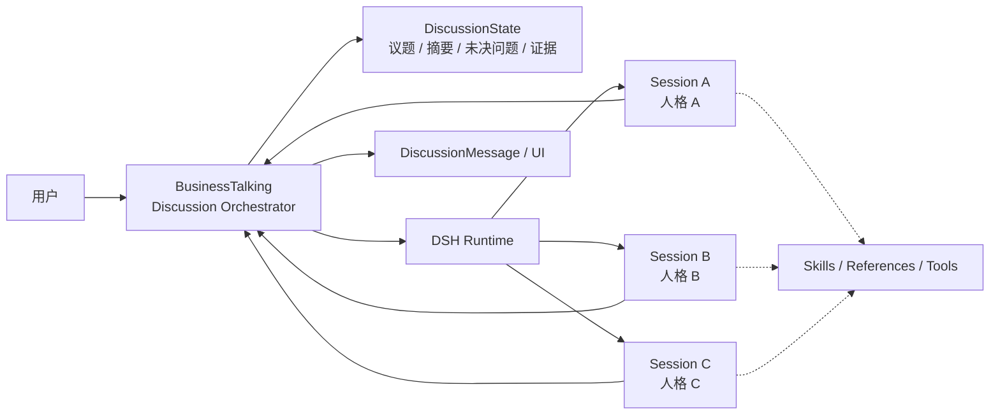

# 多人讨论：DSH Runtime 方案

## 结论

多人讨论采用“BusinessTalking 编排 + DSH Runtime 执行人格 Agent”的方案。

不建议把多个用户人格放进同一个 DSH Session。推荐一场讨论中的每个参与人格使用独立 Session：

```text
一次讨论 + 一个参与人格 = 一个 DSH Session
```

这样可以避免人格串线，同时保留多人讨论的共享上下文。

## 总体架构



## 第一阶段：受控式多人讨论（推荐）

保留当前 `runDiscussion()` 的轮次机制，由 BusinessTalking 控制发言顺序：

1. 首次运行时，为每个参与人格创建或恢复 DSH Session。
2. 每轮向人格 Session 发送当前 `DiscussionState` 和本轮任务。
3. DSH Agent 自己处理人格、Skill、Reference 和工具调用。
4. BusinessTalking 接收事件和最终结果，并保存为 `DiscussionMessage`。
5. 汇总各人格观点，更新 `DiscussionState`。
6. 进入下一轮。

当前实现已经具备迁移基础：`runDiscussion()` 负责轮次，`buffers` 保存人格上下文，`summaryBox` 保存共享摘要。

## 第二阶段：自主式多人讨论

后续可以引入 DSH 主控 Agent，由它通过 Subagent 调度各人格：

```text
DSH 主控 Agent
    ├── Persona A 子 Agent
    ├── Persona B 子 Agent
    └── Persona C 子 Agent
```

主控 Agent 可以自主决定谁发言、是否调用工具以及何时总结。但这种方式会带来更高的成本和不确定性，UI 还需要订阅子 Agent 的事件并投影为讨论消息，因此不作为第一版方案。

## 职责划分

| 模块 | 主要职责 |
|---|---|
| BusinessTalking | 讨论生命周期、轮次、发言顺序、用户干预、数据库、UI 和最终报告 |
| DSH Runtime | Agent Loop、Session 上下文、Skill 加载、Reference 按需读取、工具调用和运行事件 |
| DiscussionState | 原始议题、共享摘要、未决问题、关键证据和用户 steer |
| DiscussionMessage | DSH 事件和结果在 BusinessTalking 中的持久化投影 |

## 人格与 Reference 加载

每个参与人格的 DSH Session 创建时：

```text
systemPrompt + SKILL.md       → 初始化加载
references/ 目录和摘要        → 建立索引
具体 reference.md              → Agent 需要时按需加载
普通业务 Skill                 → 由 DSH Skill Registry 按需发现和加载
```

不再把所有 Reference 一次性拼接到 `skill` 消息中。人格配置应在讨论创建时形成快照，讨论过程中默认不动态改变。

DSH 的 Skill 机制支持先发现 Skill，再按需读取完整内容，详见 [DSH Skills 文档](https://github.com/deepseek-ai/deepseek-harness/blob/master/docs/subsystems/skills.md)。

## 数据模型建议

在现有 `Discussion` 基础上增加参与者运行信息：

```text
DiscussionParticipant
  discussionId
  personaId
  dshSessionId
  skillHash
  status
  lastEventSeq
```

关系如下：

```text
Discussion
  ├── DiscussionParticipant → Persona A → DSH Session A
  ├── DiscussionParticipant → Persona B → DSH Session B
  └── DiscussionState
```

同一个 Persona 参与不同 Discussion 时，必须使用不同的 `dshSessionId`。DSH Runtime 进程可以复用，但 Session 必须隔离。

## 当前代码的迁移映射

| 当前实现 | DSH Runtime 方案 |
|---|---|
| `runDiscussion()` | 保留为 Discussion Orchestrator |
| `buffers` | 迁移为各人格 DSH Session 的内部上下文 |
| `summaryBox` | 升级为结构化 `DiscussionState` |
| `loadSkill()` / `ensureSkillLoaded()` | 改为人格 Session 初始化和 Skill 注册 |
| `web_search` | 迁移为 DSH Runtime 工具 |
| `DiscussionMessage` | 作为 DSH 事件和结果的 UI/数据库投影 |
| `followup` | 路由到指定人格的 DSH Session |

## 运行生命周期

```text
创建 Discussion
    ↓
首次运行时创建 N 个 Persona Session
    ↓
按轮次执行并更新 DiscussionState
    ↓
暂停：保存 Session ID 和事件序号
    ↓
恢复：继续使用原 Session
    ↓
归档：BusinessTalking 做逻辑归档和数据保留
```

DSH SDK 当前主要支持关闭整个 Runtime，而不是单独删除某个 Session。因此 Session 的逻辑删除、归档和保留策略由 BusinessTalking 管理。SDK 与 Session 事件机制见 [DSH TypeScript Client](https://github.com/deepseek-ai/deepseek-harness/blob/master/packages/sdk/client/README.md) 和 [DSH Protocol](https://github.com/deepseek-ai/deepseek-harness/blob/master/packages/sdk/protocol/README.md)。

## 第一版验证范围

建议先验证一个最小闭环：

- 2 个 Persona；
- 2 轮固定顺序讨论；
- 每个 Persona 一个 DSH Session；
- 共享 `DiscussionState`；
- 支持联网搜索和 `@Persona` steer；
- 能保存事件并在 Runtime 重启后恢复。

验证通过后，再评估是否将讨论编排权交给 DSH 主控 Agent。
