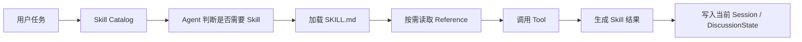

# 普通 Skill 使用：DSH Runtime

## 核心原则

在 BusinessTalking 接入 DSH Runtime 后，需要区分三类能力：

```text
Persona Skill → 我是谁
普通 Skill    → 我如何完成任务
Tool          → 我实际执行什么动作
```

人格 Skill 是人格 Session 的稳定配置；普通 Skill 是可复用的任务能力，不绑定某个 Persona。

## 基本调用流程



### 1. 发现 Skill

DSH Runtime 启动或 Session 初始化时提供 Skill Catalog，Catalog 只包含 Skill 的名称、摘要、用途和可用范围，不加载所有 Skill 正文。

### 2. 选择 Skill

Agent 根据当前任务判断是否需要使用 Skill。BusinessTalking 可以通过讨论配置限制可用 Skill，例如：

```text
允许：market-research、competitor-analysis
禁止：send-email、write-database
```

### 3. 加载 Skill 正文

Agent 确定使用某个 Skill 后，DSH Runtime 再加载对应的 `SKILL.md`。Skill 正文进入当前 Agent 的执行上下文。

### 4. 按需读取 Reference

Skill 中引用的 `references/*.md` 不应全部预加载，而是在 Agent 需要具体知识时读取对应文件：

```text
Skill Catalog
    ↓
SKILL.md
    ↓
reference-a.md（需要时读取）
    ↓
reference-b.md（不需要则不读取）
```

### 5. 调用 Tool

Skill 负责指导执行流程，Tool 负责执行外部动作。例如：

```text
market-research Skill
    └── 调用 web_search Tool
```

Skill 不应直接代替 Tool，也不应把搜索、文件读写等外部能力全部写死在 Skill 文本中。

### 6. 保存结果

Skill 的最终结果由 BusinessTalking 保存为消息或结构化状态。建议记录：

```text
skillId
skillVersion / skillHash
sessionId
discussionId
turnId
referenceIds
toolCalls
status
```

## 多人讨论中的规则

每个人格 Session 独立判断和调用 Skill：

```text
Persona A Session → market-research
Persona B Session → competitor-analysis
Persona C Session → 不调用 Skill，直接发表观点
```

不同 Session 之间不直接共享 Skill 上下文。需要共享的结果由 BusinessTalking 写入 `DiscussionState`：

```text
DiscussionState
  ├── summary
  ├── evidence
  ├── openQuestions
  └── userSteers
```

下一轮中，其他人格只读取共享结果，不读取 Persona A 的完整 Skill 执行上下文。

## 与人格 Skill 的区别

| 类型 | 加载时机 | 作用 | Session 关系 |
|---|---|---|---|
| Persona Skill | Session 创建时 | 定义身份、立场和表达方式 | 绑定当前 Persona Session |
| 普通 Skill | Agent 判断需要时 | 完成研究、分析、写作等任务 | 可被多个 Session 使用 |
| Reference | Skill 执行期间 | 提供具体知识或规则 | 按需读取 |
| Tool | 执行动作时 | 搜索、读文件、调用 API | 由 Runtime 管理 |

## 对当前代码的迁移

当前实现倾向于在 `loadSkill()` 中读取 `SKILL.md` 和全部 Reference，并拼成一条 `skill` 消息。迁移到 DSH Runtime 后建议拆分为：

```text
ensurePersonaSession()
    └── 加载人格配置和人格 SKILL.md

discoverSkills()
    └── 获取普通 Skill Catalog

getSkill(skillId)
    └── Agent 确认需要后加载 SKILL.md

readReference(referenceId)
    └── 仅读取当前任务需要的 Reference

executeTool(toolId)
    └── 由 DSH Runtime 执行并记录事件
```

因此，普通 Skill 不应在讨论开始时全部注入每个人格的上下文。人格上下文、普通 Skill 上下文和讨论共享状态应保持分层。

## Skill 生命周期与版本

普通 Skill 是文件系统或 Skill Registry 中的共享资源，不属于某个 Persona，也不需要随着 Session 删除。

为了避免讨论进行中 Skill 被修改导致结果不一致，建议：

1. Discussion 创建时记录允许使用的 Skill 版本或 hash。
2. 新讨论使用最新 Skill。
3. 已进行中的讨论继续使用原版本。
4. Skill 执行记录保留在运行轨迹中，便于审计和复现。

DSH 的 Skill 机制支持先发现 Skill，再按需加载正文和资源，详见 [DSH Skills 文档](https://github.com/deepseek-ai/deepseek-harness/blob/master/docs/subsystems/skills.md)。
