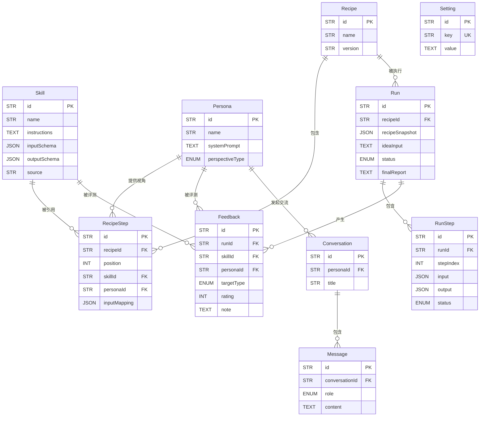
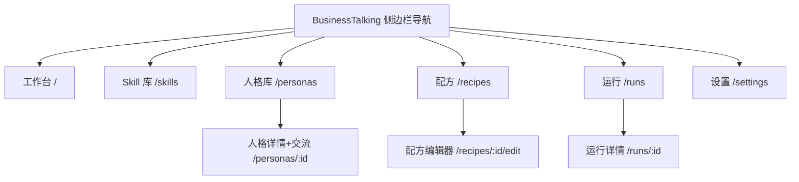

# BusinessTalking - 设计总览

> 项目可视化设计看板，汇聚 01_PRD ~ 04_UX_DESIGN 的核心设计，作为系统设计入口与总览。
> 内容仅从现有设计文档提取，不新增设计信息。

---

## 1. MVP 功能范围（来源：01_PRD）

### 1.1 产品定位
一个收录 **skill（分析技能）** 与 **人格（人格蒸馏产物）**、支持把两者编排成 **「商业可行性分析配方」**、内置大模型执行、支持 **输入驱动式交互** 与 **人格一对一交流** 的个人/小团队自用 Web 工具。

**核心痛点**：单个 skill 效果难评测、skill 需组合才覆盖完整流程、人格蒸馏未纳入结构化分析、易陷入确认偏误、传统表单式录入门槛高。

### 1.2 功能边界

```
[工作台 · 输入驱动] ── 商业想法 + @配方 引用
   │
Skill 库 ── 浏览/搜索/筛选 + 手动新增/编辑/删除 + npx 命令导入
人格库 ── 头像卡片 + 详情 + 一对一交流（会话保存/导出 Markdown）
配方编排 ── 表单式步骤编辑（skill + 可选人格 + 输入映射）
执行与输出 ── 内置 LLM 按步骤执行 → 分步结果 → 结构化可行性报告 → 导出 Markdown
效果反馈 ── 步骤/报告 1~5 星评分 + 备注 + 运行历史
```

**MVP 外**：配方分享社区、可视化拖拽画布、配方分支/并行、账号/多用户/云同步、LLM 费用代付、人格结论自动注入、npx 白名单校验、效果统计报表。

### 1.3 核心用户故事（节选）

| ID | 用户故事 |
| --- | --- |
| US03 | 把多个 skill 编排成配方（步骤可附加人格视角），一键执行完整分析流程 |
| US04 | 工作台输入想法（@配方）启动分析，获得可行性报告 |
| US05 | 配方含「风险投资人/挑剔客户」等人格质询步骤，多视角发现漏洞 |
| US06 | 对每个步骤和最终报告打分并备注，积累 skill 效果数据 |
| US09 | 通过 npx 命令导入网上 skill，免手填快速扩充 Skill 库 |
| US10 | 点击人格卡片一对一交流并保存对话，获得启发 |

---

## 2. 系统架构（来源：02_TECH）

### 2.1 技术栈

| 领域 | 选型 |
| --- | --- |
| 前端 | Next.js 16.3.4 + React 19.2 + TypeScript + Tailwind CSS 4.3 |
| 后端 | Next.js Route Handlers（单体全栈一体） |
| 数据库 | SQLite + Prisma ORM 6.19.3 |
| LLM 接入 | Vercel AI SDK 7（DeepSeek / OpenAI / Anthropic / Ollama 本地） |
| 数据校验 | zod 4 |
| 部署 | pnpm dev（端口 3001）/ Docker（可选） |

### 2.2 架构图

```
┌────────────────────────────────────────────┐
│                 Browser                    │
│   (Skill库 / 人格库 / 配方编排 / 运行 / 设置)  │
└──────────────────────┬─────────────────────┘
                       │ HTTP/JSON
                       ▼
┌────────────────────────────────────────────┐
│         Next.js (App Router, 全栈一体)      │
│  ┌──────────┐ ┌──────────┐ ┌────────────┐ │
│  │ 页面层    │ │ API Routes│ │ 配方执行引擎 │ │
│  │ (RSC/客户端)│ │ /api/v1/* │ │ engine/    │ │
│  └────┬─────┘ └────┬─────┘ └─────┬──────┘ │
│       ▼             ▼              ▼       │
│        Prisma/DB(SQLite)     LLM接入层(AI SDK) │
└───────────────────────────┬────────────────┘
                            │ HTTPS
                            ▼
        ┌──────────────────────────────────┐
        │  LLM Providers (用户自备 API Key)  │
        │  DeepSeek / OpenAI / Anthropic /  │
        │  Ollama(本地)                     │
        └──────────────────────────────────┘
```

### 2.3 目录结构（节选）

- `prisma/schema.prisma` — 数据模型定义
- `src/app/(dashboard)/` — 主界面（skills / personas / recipes / runs / settings）
- `src/app/api/v1/*` — REST API
- `src/lib/engine/` — 配方执行引擎（runner / prompt / schemas）
- `src/lib/llm/` — LLM 接入层（多 provider 装配 + Key 安全存取）
- `src/lib/import/` — npx 导入（沙箱执行 + SKILL.md 解析）
- `src/lib/chat/` — 人格对话与会话持久化
- `src/lib/seed/` — 内置精选 skill / 人格种子数据

### 2.4 部署配置

| 服务 | 端口 / 方式 | 说明 |
| --- | --- | --- |
| Next.js 开发服务器 | 3001 | 避开兄弟项目占用的 3000 |
| SQLite | 文件 | 无端口 |
| 启动流程 | `pnpm install → prisma migrate dev → prisma db seed → pnpm dev --port 3001` | 访问 http://localhost:3001 |

---

## 3. 数据模型（来源：03_DATAMODEL）

### 3.1 实体关系图



### 3.2 核心实体

| 实体 | 说明 |
| --- | --- |
| Skill | 分析技能（指令 + 输入/输出 Schema），来源 builtin / manual / npx |
| Persona | 人格蒸馏产物（systemPrompt + 视角类型），质询视角 |
| Recipe / RecipeStep | 可行性分析配方（有序步骤：skill + 可选人格 + 输入映射） |
| Run / RunStep | 一次运行（配方快照 + 分步结果），支持重试/跳过 |
| Feedback | 效果反馈（步骤/报告 1~5 星 + 备注），聚合 skill/配方效果 |
| Setting | 键值配置（LLM provider / API Key 加密存储） |
| Conversation / Message | 与人格的一对一会话（会话内记忆，可导出） |

**枚举**：`PerspectiveType`（investor/customer/competitor/economist/entrepreneur/analyst/custom）、`RunStatus`（pending/running/done/failed/cancelled）、`StepStatus`（pending/running/done/failed/skipped）、`FeedbackTargetType`（step/report）、`MessageRole`（user/assistant）。

---

## 4. 页面设计（来源：04_UX_DESIGN）

> 视觉基准：DESIGN.md（Apple 设计语言）——单一 Action Blue `#0066cc`、无装饰阴影、明暗瓦片交替、大留白、pill 即动作。

### 4.1 页面层级



### 4.2 页面结构

| 页面 | 路径 | 结构要点 |
| --- | --- | --- |
| 工作台 | / | 居中大输入框（多行 + @配方）+ 分析卡片流（竖版卡片多列网格，≥3 列） |
| Skill 库 | /skills | 列表/搜索/分类筛选 + 新增/编辑 + npx 导入弹窗（命令预览 + 日志流 + 解析候选勾选） |
| 人格库 | /personas | 头像卡片网格 + 视角筛选 + 新增 |
| 人格详情/交流 | /personas/:id | 详情 Tab（提示词/引用）+ 交流 Tab（聊天气泡 + 会话列表 + 导出笔记） |
| 配方 | /recipes | 列表 + 编辑器（步骤卡片：skill 选择器 + 人格选择器 + 顺序调整 + 运行） |
| 运行 | /runs / :id | 历史筛选视图；详情页=进度条 + 步骤时间线 + 当前步骤输入/输出 + 重试/跳过 + 最终报告 + 评分 |
| 设置 | /settings | LLM provider / API Key（掩码）/ 默认模型 / 超时 |

### 4.3 关键交互
- **工作台输入驱动**：输入想法 → `@配方` 选择（可删除标签）→ 开始分析 → 分析卡片实时更新（进度/步骤状态/报告摘要 → 展开/导出 MD）
- **npx 导入**：输入命令 → 展示风险提示需确认 → 沙箱执行（日志流式）→ 解析候选 → 勾选入库；失败可重试
- **人格交流**：聊天气泡（用户右、人格左带头像）→ 多轮对话（会话内记忆）→ 新建会话/导出笔记
- **反馈**：步骤/报告打星（1~5）+ 备注，金色星为唯一非蓝强调

---

## 5. 文档索引

| 文档 | 说明 |
| --- | --- |
| [01_PRD](01_PRD.md) | 产品需求 |
| [02_TECH](02_TECH.md) | 技术架构 |
| [03_DATAMODEL](03_DATAMODEL.md) | 数据模型 |
| [04_UX_DESIGN](04_UX_DESIGN.md) | UX 设计 |
| [05_API](05_API.md) | API 规范 |
| [06_TODOLIST](06_TODOLIST.md) | 迭代计划 |
| [DESIGN.md](DESIGN.md) | 设计系统基准（Apple 设计语言） |

---

## 6. 规则索引

| 规则 | 说明 |
| --- | --- |
| docs-update-rule | 通用文档更新规则（01-04 更新后联动） |

---

## 7. 更新记录

| 日期 | 版本 | 变更内容 | 修改人 |
| --- | --- | --- | --- |
| 2026-09-03 | 1.0 | 初次生成：从 01_PRD/02_TECH/03_DATAMODEL/04_UX_DESIGN 提取核心设计，生成设计总览 | creating-prd-graph |
