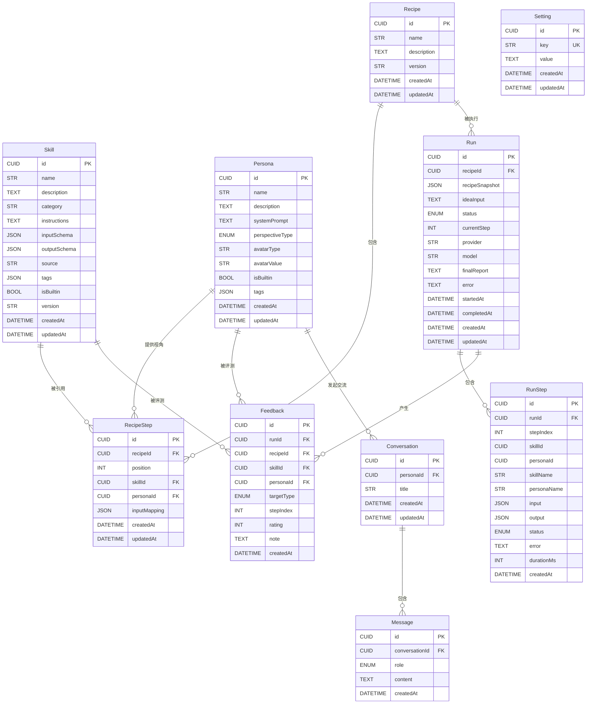

# 数据模型设计

*基于 PRD v1.1 | 项目类型：全新项目*

---

## 1. 模型概述

### 1.3 核心实体

| 实体 | 类型 | 说明 | 关联实体 |
| --- | --- | --- | --- |
| Skill | 🆕新增 | 分析技能（指令 + 输入输出 Schema） | RecipeStep |
| Persona | 🆕新增 | 人格蒸馏产物（质询视角） | RecipeStep, Feedback |
| Recipe | 🆕新增 | 可行性分析配方 | RecipeStep, Run |
| RecipeStep | 🆕新增 | 配方中的一步（skill + 可选人格） | Recipe, Skill, Persona |
| Run | 🆕新增 | 一次配方运行（含配方快照） | Recipe, RunStep, Feedback |
| RunStep | 🆕新增 | 单步执行结果 | Run |
| Feedback | 🆕新增 | 效果反馈（步骤/报告评分） | Run, Skill, Persona |
| Setting | 🆕新增 | 配置项（LLM provider、API Key） | - |
| Conversation | 🆕新增 | 与人格的一对一会话 | Persona, Message |
| Message | 🆕新增 | 会话中的单条消息 | Conversation |

### 1.4 关系总览

```
Skill 1──N RecipeStep N──1 Persona 1──N Conversation 1──N Message
                  │
Recipe 1──────────┘
  ├──N Run 1──N RunStep
  │     └──N Feedback N──1 Skill / Persona
  └──N RecipeStep
```

---

## 2. 实体关系图

### 2.1 Mermaid 格式



---

## 3. 实体详细定义

### 3.1 Skill

**描述**：收录的分析技能。指令内容为可注入 LLM 的说明（SKILL.md 提炼版），输入/输出 Schema 用于执行引擎做结构化校验与步骤间数据传递。

**字段定义**

| 字段名 | 类型 | 约束 | 默认值 | 说明 |
| --- | --- | --- | --- | --- |
| id | CUID | PK | auto | 主键 |
| name | STR | NOT NULL | - | 技能名称，最长 100 字符 |
| description | TEXT | - | NULL | 技能说明（列表展示用） |
| category | STR | NOT NULL | '通用' | 分类：商业模式/财务/战略/营销/用户研究/通用 |
| instructions | TEXT | NOT NULL | - | 技能指令全文（注入 LLM 的提示词） |
| inputSchema | JSON | - | NULL | 步骤输入 Schema（zod 描述） |
| outputSchema | JSON | - | NULL | 步骤输出 Schema（zod 描述） |
| source | STR | - | 'manual' | 来源：builtin / manual / npx |
| sourceRef | STR | - | NULL | 来源引用：npx 导入时的命令 / 来源 URL |
| tags | JSON | - | '[]' | 标签数组，用于筛选 |
| isBuiltin | BOOL | NOT NULL | false | 是否内置精选（内置不可删除） |
| version | STR | NOT NULL | '1.0' | 技能版本号 |
| createdAt | DATETIME | NOT NULL | now() | 创建时间 |
| updatedAt | DATETIME | NOT NULL | now() | 更新时间 |

**索引**

| 索引名 | 字段 | 类型 | 说明 |
| --- | --- | --- | --- |
| idx_skill_category | category | INDEX | 按分类筛选 |
| idx_skill_name | name | INDEX | 名称搜索 |

**关系**

| 关联实体 | 关系类型 | 外键 | 说明 |
| --- | --- | --- | --- |
| RecipeStep | 1:N | skillId | 被配方步骤引用（删除时 RESTRICT） |
| Feedback | 1:N | skillId | 步骤反馈聚合评测 |

---

### 3.2 Persona

**描述**：人格蒸馏产物。systemPrompt 为完整人格系统提示词，作为配方步骤中的质询视角。

**字段定义**

| 字段名 | 类型 | 约束 | 默认值 | 说明 |
| --- | --- | --- | --- | --- |
| id | CUID | PK | auto | 主键 |
| name | STR | NOT NULL | - | 人格名称，最长 100 字符 |
| description | TEXT | - | NULL | 人格简介 |
| systemPrompt | TEXT | NOT NULL | - | 人格系统提示词（蒸馏产物） |
| perspectiveType | ENUM | NOT NULL | 'custom' | 视角类型（见 4.1） |
| avatarType | STR | NOT NULL | 'auto' | 头像类型：builtin（内置插画）/ auto（自动生成） |
| avatarValue | STR | - | NULL | 头像内容：内置插画 key 或自动生成参数（首字母/视角图标） |
| isBuiltin | BOOL | NOT NULL | false | 是否内置精选 |
| tags | JSON | - | '[]' | 标签数组 |
| createdAt | DATETIME | NOT NULL | now() | 创建时间 |
| updatedAt | DATETIME | NOT NULL | now() | 更新时间 |

**索引**

| 索引名 | 字段 | 类型 | 说明 |
| --- | --- | --- | --- |
| idx_persona_type | perspectiveType | INDEX | 按视角类型筛选 |

**关系**

| 关联实体 | 关系类型 | 外键 | 说明 |
| --- | --- | --- | --- |
| RecipeStep | 1:N | personaId | 配方步骤可选附加人格（删除时 SET NULL） |
| Feedback | 1:N | personaId | 人格效果聚合评测 |
| Conversation | 1:N | personaId | 与人格的交流会话（删除时 CASCADE） |

---

### 3.3 Recipe

**描述**：可行性分析配方，由有序步骤组成。版本号随编辑递增。

**字段定义**

| 字段名 | 类型 | 约束 | 默认值 | 说明 |
| --- | --- | --- | --- | --- |
| id | CUID | PK | auto | 主键 |
| name | STR | NOT NULL | - | 配方名称，最长 100 字符 |
| description | TEXT | - | NULL | 配方用途说明 |
| version | STR | NOT NULL | '1.0' | 配方版本（编辑保存后递增） |
| createdAt | DATETIME | NOT NULL | now() | 创建时间 |
| updatedAt | DATETIME | NOT NULL | now() | 更新时间 |

**索引**

| 索引名 | 字段 | 类型 | 说明 |
| --- | --- | --- | --- |
| idx_recipe_name | name | INDEX | 名称搜索 |

**关系**

| 关联实体 | 关系类型 | 外键 | 说明 |
| --- | --- | --- | --- |
| RecipeStep | 1:N | recipeId | 配方步骤（删除时 CASCADE） |
| Run | 1:N | recipeId | 运行记录（删除时 SET NULL，历史靠快照保留） |

---

### 3.4 RecipeStep

**描述**：配方中的一步：引用一个 skill，可选附加一个人格作为质询视角。position 决定执行顺序。

**字段定义**

| 字段名 | 类型 | 约束 | 默认值 | 说明 |
| --- | --- | --- | --- | --- |
| id | CUID | PK | auto | 主键 |
| recipeId | CUID | FK, NOT NULL | - | 所属配方 |
| position | INT | NOT NULL | - | 步骤序号（从 1 开始，同配方内唯一） |
| skillId | CUID | FK, NOT NULL | - | 引用的 skill |
| personaId | CUID | FK | NULL | 附加的人格视角（可空） |
| inputMapping | JSON | - | NULL | 输入映射：本步骤输入如何取自上一步输出字段/用户输入 |
| createdAt | DATETIME | NOT NULL | now() | 创建时间 |
| updatedAt | DATETIME | NOT NULL | now() | 更新时间 |

**索引**

| 索引名 | 字段 | 类型 | 说明 |
| --- | --- | --- | --- |
| uq_recipe_position | recipeId + position | UNIQUE | 步骤顺序唯一 |
| idx_step_skill | skillId | INDEX | 查询 skill 被哪些配方使用 |
| idx_step_persona | personaId | INDEX | 查询人格被哪些配方使用 |

**关系**

| 关联实体 | 关系类型 | 外键 | 说明 |
| --- | --- | --- | --- |
| Recipe | N:1 | recipeId | 所属配方（CASCADE） |
| Skill | N:1 | skillId | 引用的技能（RESTRICT：被引用时不可删除） |
| Persona | N:1 | personaId | 附加视角（SET NULL） |

---

### 3.5 Run

**描述**：一次配方运行。保存 recipeSnapshot（配方与步骤快照），配方后续修改/删除不影响历史运行的可追溯性。

**字段定义**

| 字段名 | 类型 | 约束 | 默认值 | 说明 |
| --- | --- | --- | --- | --- |
| id | CUID | PK | auto | 主键 |
| recipeId | CUID | FK | NULL | 来源配方（删除后置 NULL，快照保留） |
| recipeSnapshot | JSON | NOT NULL | - | 配方+步骤完整快照（名称、skill/persona 快照） |
| ideaInput | TEXT | NOT NULL | - | 用户输入的商业想法 |
| status | ENUM | NOT NULL | 'pending' | 运行状态（见 4.2） |
| currentStep | INT | NOT NULL | 0 | 当前执行到的步骤序号 |
| provider | STR | - | NULL | 使用的 LLM provider |
| model | STR | - | NULL | 使用的模型名 |
| finalReport | TEXT | - | NULL | 最终可行性报告（Markdown） |
| error | TEXT | - | NULL | 失败原因（status=failed 时） |
| startedAt | DATETIME | - | NULL | 开始执行时间 |
| completedAt | DATETIME | - | NULL | 完成时间 |
| createdAt | DATETIME | NOT NULL | now() | 创建时间 |
| updatedAt | DATETIME | NOT NULL | now() | 更新时间 |

**索引**

| 索引名 | 字段 | 类型 | 说明 |
| --- | --- | --- | --- |
| idx_run_recipe | recipeId | INDEX | 按配方查运行历史 |
| idx_run_status | status | INDEX | 按状态筛选 |
| idx_run_created | createdAt | INDEX | 按时间倒序取历史 |

**关系**

| 关联实体 | 关系类型 | 外键 | 说明 |
| --- | --- | --- | --- |
| Recipe | N:1 | recipeId | 来源配方（SET NULL） |
| RunStep | 1:N | runId | 步骤执行结果（CASCADE） |
| Feedback | 1:N | runId | 效果反馈（CASCADE） |

---

### 3.6 RunStep

**描述**：配方单步的执行结果。记录 LLM 调用输入/输出、状态与耗时；skill/persona 名称冗余存储便于快照展示。

**字段定义**

| 字段名 | 类型 | 约束 | 默认值 | 说明 |
| --- | --- | --- | --- | --- |
| id | CUID | PK | auto | 主键 |
| runId | CUID | FK, NOT NULL | - | 所属运行 |
| stepIndex | INT | NOT NULL | - | 对应配方步骤序号 |
| skillId | CUID | - | NULL | 执行时 skill 快照 ID |
| personaId | CUID | - | NULL | 执行时人格快照 ID |
| skillName | STR | NOT NULL | - | skill 名称快照 |
| personaName | STR | - | NULL | 人格名称快照 |
| input | JSON | NOT NULL | - | 送入 LLM 的结构化输入 |
| output | JSON | - | NULL | LLM 结构化输出（校验后） |
| status | ENUM | NOT NULL | 'pending' | 步骤状态（见 4.3） |
| error | TEXT | - | NULL | 失败/跳过原因 |
| durationMs | INT | - | NULL | 耗时（毫秒） |
| createdAt | DATETIME | NOT NULL | now() | 创建时间 |

**索引**

| 索引名 | 字段 | 类型 | 说明 |
| --- | --- | --- | --- |
| idx_runstep_run | runId | INDEX | 按运行查步骤 |

**关系**

| 关联实体 | 关系类型 | 外键 | 说明 |
| --- | --- | --- | --- |
| Run | N:1 | runId | 所属运行（CASCADE） |

---

### 3.7 Feedback

**描述**：效果反馈。可对单步（targetType=step）或最终报告（targetType=report）打星 1~5 并备注；记录关联的 skill/persona/recipe，供"哪个 skill/配方有效"的聚合评测。

**字段定义**

| 字段名 | 类型 | 约束 | 默认值 | 说明 |
| --- | --- | --- | --- | --- |
| id | CUID | PK | auto | 主键 |
| runId | CUID | FK, NOT NULL | - | 所属运行 |
| recipeId | CUID | FK | NULL | 关联配方（聚合维度） |
| skillId | CUID | FK | NULL | 关联 skill（targetType=step 时填写） |
| personaId | CUID | FK | NULL | 关联人格（该步骤附有人格时填写） |
| targetType | ENUM | NOT NULL | - | 反馈目标（见 4.4） |
| stepIndex | INT | - | NULL | targetType=step 时的步骤序号 |
| rating | INT | NOT NULL | - | 评分 1~5 |
| note | TEXT | - | NULL | 备注 |
| createdAt | DATETIME | NOT NULL | now() | 创建时间 |

**索引**

| 索引名 | 字段 | 类型 | 说明 |
| --- | --- | --- | --- |
| idx_fb_run | runId | INDEX | 按运行查反馈 |
| idx_fb_skill | skillId | INDEX | skill 效果聚合 |
| idx_fb_recipe | recipeId | INDEX | 配方效果聚合 |

**关系**

| 关联实体 | 关系类型 | 外键 | 说明 |
| --- | --- | --- | --- |
| Run | N:1 | runId | 所属运行（CASCADE） |
| Skill | N:1 | skillId | 被评测的 skill（SET NULL） |
| Persona | N:1 | personaId | 被评测的人格（SET NULL） |

> 设计说明：同一目标允许重复反馈，UI 层更新该目标的最新一条（重评时覆盖旧记录），避免聚合重复计数。

---

### 3.8 Setting

**描述**：键值配置。value 存储加密后的敏感配置（如 LLM API Key）或普通配置（如默认 provider/模型）。

**字段定义**

| 字段名 | 类型 | 约束 | 默认值 | 说明 |
| --- | --- | --- | --- | --- |
| id | CUID | PK | auto | 主键 |
| key | STR | UK, NOT NULL | - | 配置键（如 llm.provider、llm.apiKey、llm.model） |
| value | TEXT | NOT NULL | - | 配置值（敏感项加密存储） |
| createdAt | DATETIME | NOT NULL | now() | 创建时间 |
| updatedAt | DATETIME | NOT NULL | now() | 更新时间 |

**索引**

| 索引名 | 字段 | 类型 | 说明 |
| --- | --- | --- | --- |
| uq_setting_key | key | UNIQUE | 配置键唯一 |

**关系**：无

---

### 3.9 Conversation

**描述**：用户与某个人格的一对一交流会话。会话内保持人格角色设定，可回看、可导出。

**字段定义**

| 字段名 | 类型 | 约束 | 默认值 | 说明 |
| --- | --- | --- | --- | --- |
| id | CUID | PK | auto | 主键 |
| personaId | CUID | FK, NOT NULL | - | 交流的人格 |
| title | STR | - | NULL | 会话标题（由首条消息自动生成，最长 100 字符） |
| createdAt | DATETIME | NOT NULL | now() | 创建时间 |
| updatedAt | DATETIME | NOT NULL | now() | 更新时间 |

**索引**

| 索引名 | 字段 | 类型 | 说明 |
| --- | --- | --- | --- |
| idx_conv_persona | personaId | INDEX | 按人格查会话 |
| idx_conv_updated | updatedAt | INDEX | 按更新时间倒序 |

**关系**

| 关联实体 | 关系类型 | 外键 | 说明 |
| --- | --- | --- | --- |
| Persona | N:1 | personaId | 交流对象（CASCADE） |
| Message | 1:N | conversationId | 会话消息（CASCADE） |

---

### 3.10 Message

**描述**：会话中的单条消息，按创建时间排序构成对话。

**字段定义**

| 字段名 | 类型 | 约束 | 默认值 | 说明 |
| --- | --- | --- | --- | --- |
| id | CUID | PK | auto | 主键 |
| conversationId | CUID | FK, NOT NULL | - | 所属会话 |
| role | ENUM | NOT NULL | - | 消息角色（见 4.5） |
| content | TEXT | NOT NULL | - | 消息内容 |
| createdAt | DATETIME | NOT NULL | now() | 创建时间 |

**索引**

| 索引名 | 字段 | 类型 | 说明 |
| --- | --- | --- | --- |
| idx_msg_conv | conversationId | INDEX | 按会话查消息（时间序） |

**关系**

| 关联实体 | 关系类型 | 外键 | 说明 |
| --- | --- | --- | --- |
| Conversation | N:1 | conversationId | 所属会话（CASCADE） |

---

## 4. 枚举定义

### 4.1 PerspectiveType（人格视角类型）

| 值 | 说明 |
| --- | --- |
| investor | 风险投资人 |
| customer | 挑剔客户 |
| competitor | 竞争对手 |
| economist | 奥派经济学家 |
| entrepreneur | 连续创业者 |
| analyst | 行业分析师 |
| custom | 自定义 |

### 4.2 RunStatus（运行状态）

| 值 | 说明 |
| --- | --- |
| pending | 等待执行 |
| running | 执行中 |
| done | 已完成（报告已生成） |
| failed | 失败（error 记录原因） |
| cancelled | 已取消 |

### 4.3 StepStatus（步骤状态）

| 值 | 说明 |
| --- | --- |
| pending | 等待执行 |
| running | 执行中 |
| done | 完成 |
| failed | 失败（error 记录原因） |
| skipped | 已跳过（用户跳过或依赖步骤失败） |

### 4.4 FeedbackTargetType（反馈目标类型）

| 值 | 说明 |
| --- | --- |
| step | 单个步骤 |
| report | 最终报告 |

### 4.5 MessageRole（消息角色）

| 值 | 说明 |
| --- | --- |
| user | 用户 |
| assistant | 人格（助手） |

---

## 5. 字段类型速查

| 简写 | 完整类型 | 说明 |
| --- | --- | --- |
| CUID | CUID/UUID | 唯一标识符 |
| STR | String/VARCHAR(255) | 短字符串 |
| TEXT | Text | 长文本 |
| INT | Integer | 整数 |
| FLOAT | Float/Decimal | 浮点数 |
| BOOL | Boolean | 布尔值 |
| DATE | DateTime | 日期时间 |
| JSON | JSON/JSONB | JSON 对象 |
| ENUM | Enum | 枚举类型 |

---

*生成时间：2026-09-01 11:52*

## 更新记录

| 日期 | 版本 | 变更内容 | 修改人 |
| ---- | ---- | -------- | ------ |
| 2026-09-01 | 1.0 | 初版创建：8 个实体、4 组枚举、关系与索引定义 | 沟通确认 |
| 2026-09-01 | 1.1 | 新增 Conversation/Message 实体、人格头像字段、Skill 来源引用字段（npx） | 沟通确认 |
