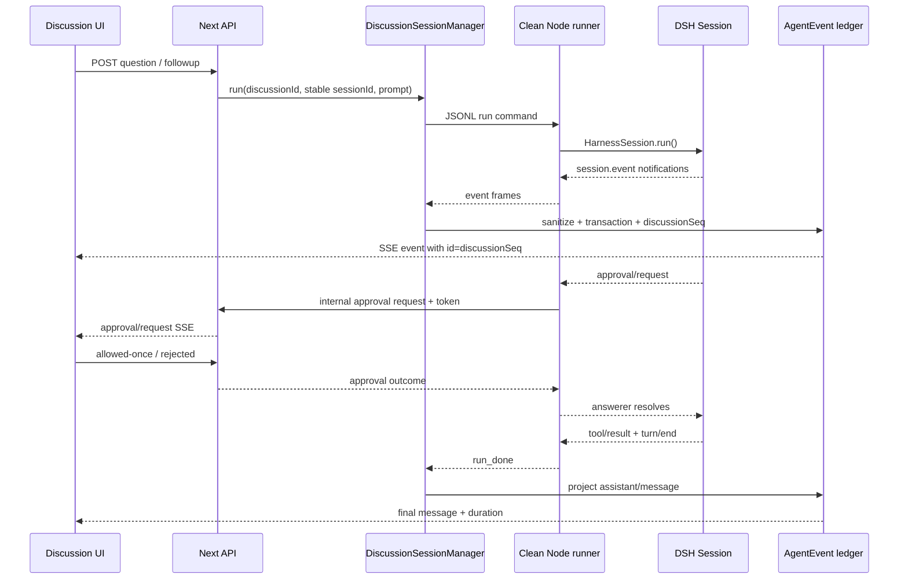

# DSH Session 审批与可观测讨论链路实施计划

> **For agentic workers:** REQUIRED SUB-SKILL: Use `superpowers:subagent-driven-development` (recommended) or `superpowers:executing-plans` to implement this plan task-by-task. Steps use checkbox (`- [ ]`) syntax for tracking.

**Goal:** 按原生 DSH WebUI 的 Session 语义，为每个 BusinessTalking 讨论建立稳定的 DSH Session、可重放事件流、逐次工具审批通道，并实时展示已发出的思考块、工具调用、结果、状态和耗时。

**Architecture:** Next.js 只负责讨论状态、权限配置、事件 ledger 和 UI；每个 Discussion 由一个独立的干净 Node runner 持有一个长期存活的 `DeepSeekHarness`，每个参与者继续使用自己的稳定 DSH `sessionId`。runner 通过 JSON Lines 转发 SDK `onNotification`，BusinessTalking 在数据库事务提交后广播可重放事件；DSH plugin 的 `approval/request` answerer 通过带内部 token 的本地 HTTP bridge 暂停在审批点，浏览器只提交 `allowed-once` 或 `rejected`。

**Tech Stack:** Next.js 16.3.4 App Router、React 19、TypeScript、Prisma 6 + SQLite、Vitest 4、pnpm、`@deepseek-ai/dsh-sdk-client@0.1.2-rc.1`、`@deepseek-ai/dsh@0.1.2-rc.1`、DSH Cordis plugin/patch。

**Spec:** `docs/plan/dsh-runtime-execution-plan.md`、`docs/plan/dsh-runtime-migration-review.md`、`docs/plan/step-5-dsh-plugin-api-notes.md`；本计划同时落实本次已确认的设计决策：按 `deepseek-harness` 原生 Session event / approval 语义适配，不直接复制 DSH WebUI 的 React 包。

## Global Constraints

- 原生语义必须保留：Session event 是事实来源；UI 从事件构建过程视图；审批请求只携带 `toolName`、`callId`、`reason`，工具参数通过对应 `tool/call` 事件关联。
- “思考链”只展示 DSH 实际发出的 reasoning/thinking 内容块；不得猜测、补写或暴露模型隐藏 CoT。
- 当前发布安全边界保持不变：生产模型可见和可执行工具仅为 `skill`、`read_skill_reference`；`tool-bash`、`tool-pwsh`、文件写入、编辑、子 Agent、`tool-web` 和 `web_search` 均不因本计划自动开启。
- 本计划允许增加审批通道和 UI，但不借审批之名放宽 P0 roster。当前 `permissionMode` 只接受 `read-only`；`workspace-write`、`danger-full-access` 不出现在可选项中，待另立权限扩展计划。
- `approvalPolicy` 只接受 `ask`、`never`，默认 `ask`；`allowed-once` 是唯一授权结果，不实现 always-allow。
- 每个讨论的 Persona 使用现有 `DiscussionParticipant.dshSessionId`；不得继续为普通回合调用 `freshTurnSessionId()`。重试创建新 `DiscussionTurn.attempt`，但仍使用同一个 participant Session。
- runner 必须独立于 Next 进程运行，保留显式 DSH provider/model/cwd/home/patch 配置；缺配置、协议损坏、Session 不匹配、空回复或非零退出均 fail closed，并在所有退出路径 `close()`。
- 所有事件先脱敏再落库/发给浏览器：删除 API key、authorization、cookie、token、secret、密码以及宿主绝对路径；工具输出和文本块设置大小上限。
- 审批 pending 只存于当前进程；server/runner 重启时不伪造授权，未完成请求返回 `unavailable` 或 `cancelled`，原生 `approval/asked` / `approval/decided` 审计事件仍尽力保存。
- 本次范围明确不包含 provider/baseURL 路由重构、1v1 跨回合历史承接、Moderator 完整发言正文、steer 状态接通、真正的 state CAS、AgentEvent 全资料包冻结、archive/purge 调度；已有旧路径只在兼容期保留，不得被新路径调用。
- 修改 Next.js route/stream/component 前，执行 AI 必须先阅读当前安装包中的 `node_modules/next/dist/docs/01-app/01-getting-started/15-route-handlers.md`、`node_modules/next/dist/docs/01-app/02-guides/streaming.md`、`node_modules/next/dist/docs/01-app/03-api-reference/03-file-conventions/route.md` 和 `node_modules/next/dist/docs/01-app/03-api-reference/03-functions/next-request.md`。
- 每个任务遵循 TDD：先写一个会失败的测试，确认失败原因，写最小实现，运行任务测试和全量测试，再单独提交；不得用 `git reset --hard` 或 `git checkout --` 覆盖用户改动。

---

## 目标数据流



## 文件边界

### 新增

- `src/lib/dsh/session-events.ts`：Session event、runner frame、客户端事件的窄类型和校验。
- `src/lib/discussion/event-ledger.ts`：事件事务写入、discussion cursor 分配、重放查询和 assistant message 投影。
- `src/lib/discussion/approval-bridge.ts`：Discussion 级 pending approval、一次性决策、超时/关闭和幂等。
- `src/lib/runtime/dsh-child-env.ts`：长期 runner 与旧 one-shot runner 共用的显式 child env 构造。
- `src/lib/runtime/session-process.ts`：父进程 JSONL runner client，负责 ready、event、done、error 和 child close。
- `src/lib/runtime/discussion-session-manager.ts`：按 discussion 管理长期 runner、稳定 Session、profile 冲突和并发锁。
- `scripts/dsh-session.mjs`：干净 Node 进程中的长期 `DeepSeekHarness` 命令循环。
- `src/app/api/internal/dsh/approval/route.ts`：仅供 runner/plugin 调用的本地审批等待端点。
- `src/app/api/v1/discussions/[id]/approvals/[approvalId]/route.ts`：浏览器提交一次性审批决定的用户端点。
- `src/app/api/v1/discussions/[id]/permissions/route.ts`：Discussion 级 `read-only` / approval policy 更新端点。
- `src/hooks/use-discussion-events.ts`：带 cursor 的 SSE 连接、重连和事件去重。
- `src/lib/discussion/dsh-turn-projection.ts`：纯函数 reducer，把事件折叠为 turn/process/tool/reasoning/approval 视图。
- `src/components/discussions/dsh-turn-process.tsx`：可折叠过程摘要和行项目。
- `src/components/discussions/dsh-approval-panel.tsx`：composer takeover 审批面板。
- `src/components/discussions/discussion-permission-control.tsx`：输入框左下角的 Discussion 权限/审批控制。
- `prisma/migrations/20260907000100_dsh_session_observability/migration.sql`：事件 cursor、事件时间和 Discussion 权限字段迁移。

### 修改

- `prisma/schema.prisma`：增加 Discussion 权限字段、AgentEvent discussion cursor/时间、事件消息幂等键和 cursor model。
- `src/lib/dsh/events.ts`、`src/lib/dsh/manifest.ts`：保留原有 P0 校验并补充事件时间、权限配置和 UI projection 所需字段。
- `runtime/dsh-plugin/index.mjs`：在 agent scope 上注册 approval answerer；审批 policy 每次请求重新读取当前 manifest。
- `src/lib/runtime/turn-process.ts`、`src/lib/runtime/singleton.ts`：复用 child env 和 runner 配置，但不再把新路径绑定到 one-shot runner。
- `src/lib/discussion/dsh-service.ts`、`src/lib/discussion/orchestrator.ts`、`src/lib/discussion/oneonone-dsh.ts`：统一通过 Discussion Session manager 执行并接入事件 ledger。
- `src/app/api/v1/discussions/[id]/route.ts`、`src/app/api/v1/discussions/[id]/stream/route.ts`：返回权限/事件 cursor，提供事务后事件重放和 pending approval 初始投影。
- `src/app/api/v1/discussions/[id]/steer/route.ts`、`src/app/api/v1/discussions/[id]/followup/route.ts`、`src/app/api/v1/discussions/[id]/participants/[participantId]/retry/route.ts`：保留现有 HTTP 兼容响应，但所有执行落到稳定 Session。
- `src/lib/discussion/broadcast.ts`：从无 payload 的 `change` 通知升级为带 discussionSeq 的 typed live event。
- `src/app/(dashboard)/discussions/page.tsx`：使用事件 reducer、过程组件、审批面板和权限控制，删除依赖“正在思考”闪现的主状态模型。
- `tests/unit`、`tests/e2e`：新增协议、ledger、manager、审批、reducer、stream 和真实 DSH smoke 覆盖。

---

## Task 0：执行前基线（不改代码、不提交）

**Files:**

- Read: `AGENTS.md`
- Read: `docs/plan/dsh-p0-remediation-execution-plan.md`
- Read: `docs/plan/dsh-runtime-execution-plan.md`
- Read: `docs/plan/dsh-runtime-migration-review.md`
- Read: `docs/plan/step-5-dsh-plugin-api-notes.md`

**Interfaces:**

- Consumes: 当前 checkout 与已有用户改动。
- Produces: 执行记录中的基线输出；不产生代码变更。

- [ ] **Step 1: 记录工作树和运行链路**

```powershell
git -c safe.directory=* status --short --branch
git -c safe.directory=* log -5 --oneline --decorate
rg -n "runOneOnOneTurn|runTurnViaProcess|runTurnViaDsh|publish\(|AgentEvent|DiscussionTurn" src scripts tests -g '*.ts' -g '*.mjs'
```

记录任何未提交文件；不得因为工作树非 clean 而覆盖它们。

- [ ] **Step 2: 阅读 Next 16 相关指南**

```powershell
Get-Content -Raw 'node_modules/next/dist/docs/01-app/01-getting-started/15-route-handlers.md'
Get-Content -Raw 'node_modules/next/dist/docs/01-app/02-guides/streaming.md'
Get-Content -Raw 'node_modules/next/dist/docs/01-app/03-api-reference/03-file-conventions/route.md'
Get-Content -Raw 'node_modules/next/dist/docs/01-app/03-api-reference/03-functions/next-request.md'
```

- [ ] **Step 3: 运行基线检查**

```powershell
pnpm exec vitest run
pnpm exec tsc --noEmit --incremental false
```

Expected: 保存现有通过数和已知失败；后续不得把基线失败误报成新功能回归。

- [ ] **Step 4: 确认实际 DSH 配置入口**

```powershell
pnpm exec dsh --profile sdk --dump-config
```

Expected: 记录实际 profile、entry id、patch 解析结果以及 `skill`、`agent-loop`、`system-prompt`、`session-projection` 的存在；不得把桌面版 DSH 配置当作本项目配置。

---

## Task 1：固定 Session event、runner frame 和客户端 projection 契约

**Files:**

- Create: `src/lib/dsh/session-events.ts`
- Modify: `src/lib/dsh/events.ts`
- Test: `tests/unit/dsh-session-events.test.ts`
- Test: `tests/unit/dsh-events.test.ts`

**Interfaces:**

- Consumes: DSH SDK `session.event` notification；现有 `extractEvent()` 和 `sanitizeData()`。
- Produces: 后续任务必须使用的 `RunnerFrame`、`MappedSessionEvent`、`DiscussionLiveEvent` 和 event-type projection helper。

```ts
export interface RunnerRunCommand {
  type: "run";
  requestId: string;
  sessionId: string;
  prompt: string;
}

export type RunnerFrame =
  | { type: "ready" }
  | { type: "event"; requestId: string; sessionId: string; notification: DshNotification }
  | { type: "done"; requestId: string; sessionId: string; finalResponse: string }
  | { type: "error"; requestId?: string; code: string; stage: string; error: string }
  | { type: "fatal"; code: string; stage: string; error: string };

export interface MappedSessionEvent {
  sessionId: string;
  seq: number;
  eventType: string;
  eventTimeMs: number | null;
  data: Record<string, unknown>;
}

export type MappedEvent = MappedSessionEvent;

export interface DiscussionLiveEvent {
  type: "dsh-event";
  discussionId: string;
  discussionSeq: number;
  participantId: string | null;
  sessionId: string;
  seq: number;
  eventType: string;
  eventTimeMs: number | null;
  data: Record<string, unknown>;
}
```

- [ ] **Step 1: 先写失败测试**

覆盖以下断言：

1. `extractMappedEvent()` 保留 `event.time` 为 `eventTimeMs`，缺失或非有限数字变成 `null`。
2. runner frame parser 拒绝空行、损坏 JSON、未知 frame type、非字符串 requestId/sessionId 和超过单行上限的内容。
3. client projection 只保留 `tool/call` 的 callId/name/arguments、`tool/result` 的 callId/status/output/error、assistant 的可见文本/reasoning 块和 approval 的 toolName/callId/reason；不返回 API key、authorization、宿主路径。
4. `approval/asked` 与 `approval/decided` 保留原生 `id`，但不把工具参数复制到审批 payload。

```ts
it("keeps finite DSH event time and rejects invalid runner frames", () => {
  expect(extractMappedEvent(notificationWithTime(1730000000123))).toMatchObject({ eventTimeMs: 1730000000123 });
  expect(() => parseRunnerFrame("{bad-json}")).toThrow();
  expect(() => parseRunnerFrame(JSON.stringify({ type: "done", requestId: 1 }))).toThrow();
});
```

- [ ] **Step 2: 运行测试确认失败**

```powershell
pnpm exec vitest run tests/unit/dsh-session-events.test.ts tests/unit/dsh-events.test.ts
```

Expected: FAIL，因为新类型、parser 和 event projection 尚不存在。

- [ ] **Step 3: 写最小实现**

在 `src/lib/dsh/session-events.ts` 实现 `parseRunnerFrame(line: string): RunnerFrame`、`isDshNotification(value: unknown)` 和 `projectClientEvent(mapped: MappedSessionEvent): Record<string, unknown>`；在 `src/lib/dsh/events.ts` 扩展 `MappedEvent` 的 `eventTimeMs`，所有字段继续经过现有递归脱敏和大小限制。

- [ ] **Step 4: 运行测试确认通过**

```powershell
pnpm exec vitest run tests/unit/dsh-session-events.test.ts tests/unit/dsh-events.test.ts
```

- [ ] **Step 5: 提交**

```powershell
git add src/lib/dsh/session-events.ts src/lib/dsh/events.ts tests/unit/dsh-session-events.test.ts tests/unit/dsh-events.test.ts
git commit -m "test: define DSH session event protocol"
```

---

## Task 2：增加事件 ledger、Discussion cursor 和权限持久化

**Files:**

- Modify: `prisma/schema.prisma`
- Create: `prisma/migrations/20260907000100_dsh_session_observability/migration.sql`
- Create: `src/lib/discussion/event-ledger.ts`
- Modify: `src/lib/dsh/events.ts`
- Test: `tests/unit/dsh-event-ledger.test.ts`
- Test: `tests/unit/dsh-service.test.ts`

**Interfaces:**

- Consumes: `MappedSessionEvent`、`DiscussionLiveEvent`、现有 `AgentEvent` unique `(sessionId, seq)`。
- Produces: `ingestDiscussionEvent()`、`listDiscussionEventsAfter()`、`getDiscussionEventCursor()` 和幂等 assistant message projection。

```ts
export interface IngestDiscussionEventInput {
  discussionId: string;
  participantId: string | null;
  notification: DshNotification;
}

export interface IngestDiscussionEventResult {
  inserted: boolean;
  event: DiscussionLiveEvent | null;
  finalText: string;
  sourceEventId: string | null;
}

export async function ingestDiscussionEvent(
  input: IngestDiscussionEventInput,
): Promise<IngestDiscussionEventResult>;

export async function listDiscussionEventsAfter(
  discussionId: string,
  afterDiscussionSeq: number,
): Promise<DiscussionLiveEvent[]>;
```

- [ ] **Step 1: 先写失败测试**

覆盖以下行为：

1. 两个不同 Session 的事件获得同一 Discussion 内连续 `discussionSeq`；同一个 `(sessionId, seq)` 重复 ingest 返回同一事件而不增加 cursor。
2. ingest 在数据库事务提交后才调用 `publish()`；事务失败时既不广播也不创建 `DiscussionMessage`。
3. `assistant/message` 只创建一条带 `sourceEventId` 的 DiscussionMessage，重复通知不会重复消息。
4. `tool/call`、`tool/result` 和 reasoning event 的 `eventTimeMs` 可被查询并按 cursor 升序重放。
5. participant 的 `dshSessionId` 与通知 session 不一致时抛 `DSH_PROTOCOL_FAILED`；moderator 只能匹配 `Discussion.moderatorSessionId`。

```ts
it("allocates one idempotent discussion cursor across sessions", async () => {
  const first = await ingestDiscussionEvent(personaEvent("session-a", 1));
  const duplicate = await ingestDiscussionEvent(personaEvent("session-a", 1));
  const second = await ingestDiscussionEvent(personaEvent("session-b", 1));
  expect(first.event?.discussionSeq).toBe(1);
  expect(duplicate.inserted).toBe(false);
  expect(second.event?.discussionSeq).toBe(2);
});
```

- [ ] **Step 2: 运行测试确认失败**

```powershell
pnpm exec vitest run tests/unit/dsh-event-ledger.test.ts
```

Expected: FAIL，因为 cursor model、ledger 函数和 message 幂等键尚不存在。

- [ ] **Step 3: 修改 Prisma schema 和 migration**

在 `Discussion` 增加：

```prisma
permissionMode String @default("read-only")
approvalPolicy String @default("ask")
```

在 `AgentEvent` 增加：

```prisma
discussionSeq Int?
eventTimeMs   Float?
```

在 `DiscussionMessage` 为 `sourceEventId` 增加唯一索引；新增：

```prisma
model DiscussionEventCursor {
  discussionId String @id
  nextSeq      Int    @default(1)
  discussion   Discussion @relation(fields: [discussionId], references: [id], onDelete: Cascade)
}
```

在 `Discussion` model 中增加反向关系 `eventCursor DiscussionEventCursor?`。

migration 要做到：新字段默认 `read-only` / `ask`；既有 AgentEvent 的 `discussionSeq` 允许为 null；新写入事件使用 cursor；既有事件按 `discussionId, createdAt, id` 回填可排序序号，并把 cursor 初始化为 `max + 1`。不能删除既有事件。

- [ ] **Step 4: 实现事务写入和重放**

在 `event-ledger.ts` 中按以下顺序实现：

1. `extractMappedEvent()`，校验 session、seq、event type 和 payload 上限。
2. 事务内先按 `(sessionId, seq)` 查已有记录；不存在时原子递增 `DiscussionEventCursor.nextSeq`，再创建 AgentEvent。
3. 使用事务返回的 `AgentEvent.id` 生成客户端 projection；`assistant/message` 通过 `sourceEventId` upsert 投影 DiscussionMessage。
4. 更新 participant `lastEventSeq` 时使用较大值，不能回退。
5. 事务成功后才调用 typed `publish(discussionId, event)`；重复事件不广播。
6. `listDiscussionEventsAfter()` 只查询 `discussionSeq > after` 且非 null 的事件，按升序返回 client projection。

- [ ] **Step 5: 运行迁移、生成 client 并测试**

```powershell
pnpm exec prisma migrate deploy
pnpm exec prisma generate
pnpm exec vitest run tests/unit/dsh-event-ledger.test.ts tests/unit/dsh-service.test.ts
```

- [ ] **Step 6: 提交**

```powershell
git add prisma/schema.prisma prisma/migrations/20260907000100_dsh_session_observability/migration.sql src/lib/discussion/event-ledger.ts src/lib/dsh/events.ts tests/unit/dsh-event-ledger.test.ts tests/unit/dsh-service.test.ts
git commit -m "feat: persist replayable DSH discussion events"
```

---

## Task 3：实现长期存活的干净 Node Session runner

**Files:**

- Create: `src/lib/runtime/dsh-child-env.ts`
- Create: `src/lib/runtime/session-process.ts`
- Create: `scripts/dsh-session.mjs`
- Modify: `src/lib/runtime/turn-process.ts`
- Test: `tests/unit/dsh-session-process.test.ts`
- Test: `tests/fixtures/dsh-session-runner.mjs`

**Interfaces:**

- Consumes: Task 1 的 `RunnerRunCommand` / `RunnerFrame`；现有 `getDshTurnConfig()` 和 `DeepSeekHarness`。
- Produces: `DshSessionProcess.start()`、`.run()`、`.close()`，以及可在一个 runner 中复用多个稳定 Session 的父子协议。

```ts
export interface DshSessionProcessOptions {
  cwd: string;
  dshBin: string;
  dshHome: string;
  patches: string[];
  provider: string;
  model: string;
  apiKey?: string;
  approvalUrl?: string;
  approvalToken?: string;
  onNotification?: (requestId: string, notification: DshNotification) => Promise<void> | void;
  onFatal?: (error: DshError) => void;
}

export class DshSessionProcess {
  start(): Promise<void>;
  run(input: { sessionId: string; prompt: string }): Promise<{ sessionId: string; finalResponse: string }>;
  close(): Promise<void>;
}
```

- [ ] **Step 1: 先写失败测试**

使用 fixture child 验证：

1. `ready` 在任何 run 之前到达。
2. `event` frame 在 `done` 之前回调，且回调 Promise 完成后 run 才 resolve。
3. 同一 Session 同时 run 被 `DshSessionBusyError` 拒绝；不同 Session 的 requestId 可以交错返回并正确关联。
4. 损坏 JSON、未知 requestId、sessionId 不匹配、child `close`、非零退出都拒绝对应 run；fatal close 同时拒绝所有 pending run。
5. `close()` 可重复调用，close 失败不覆盖原始 run 错误。

```ts
it("does not resolve a run before its final event callback", async () => {
  const seen: string[] = [];
  const process = createFixtureProcess({ onNotification: async () => { await Promise.resolve(); seen.push("event"); } });
  const result = await process.run({ sessionId: "bt-discussion-a", prompt: "hello" });
  expect(result.finalResponse).toBe("reply");
  expect(seen).toEqual(["event"]);
});
```

- [ ] **Step 2: 运行测试确认失败**

```powershell
pnpm exec vitest run tests/unit/dsh-session-process.test.ts
```

Expected: FAIL，因为长期 runner、JSONL client 和 fixture 尚不存在。

- [ ] **Step 3: 实现显式 child env**

把旧 `turn-process.ts` 的公共 env 构造抽到 `dsh-child-env.ts`。长期 runner 的 env 只能包含：系统运行所需的最小 PATH/临时目录、`BT_DSH_CWD`、`BT_DSH_HOME`、`BT_DSH_BIN`、`BT_DSH_PROVIDER`、`BT_DSH_MODEL`、`BT_DSH_PATCHES`、`DSH_PERMISSION_MODE=read-only` 以及必要的 API key 和内部 approval URL/token。不要设置 `BT_DSH_SESSION_ID`、`BT_DSH_PROMPT`；Session 和 prompt 只走 JSONL。

- [ ] **Step 4: 实现 `scripts/dsh-session.mjs`**

runner 启动一次 `DeepSeekHarness` 并执行 `await harness.start()`；stdin 每行解析一个 `run` 或 `shutdown` command；run 时调用：

```js
await harness.run(command.prompt, {
  sessionId: command.sessionId,
  onNotification: (notification) => emit({
    type: "event",
    requestId: command.requestId,
    sessionId: command.sessionId,
    notification,
  }),
});
```

输出只能是每行一个 JSON frame。事件 frame 以收到顺序发送；单回合模型错误发 `error` 并保留 runner（仅 `DSH_TURN_FAILED` 可继续），传输/初始化/协议/manifest 错误发 `fatal` 并关闭。stdin EOF、`shutdown`、SIGTERM 和所有 catch 路径均执行 `await harness.close()`。

- [ ] **Step 5: 实现 `DshSessionProcess`**

父进程 spawn `node scripts/dsh-session.mjs`，维护 `readyPromise`、`Map<requestId, PendingRun>` 和每个 request 的 event tail；写入命令前验证非空 sessionId/prompt。解析 stdout 每行，拒绝非 JSON、超长行和未知 frame；`done` 前 await event tail；child close 时按错误类别拒绝所有未完成请求。

- [ ] **Step 6: 运行测试确认通过**

```powershell
pnpm exec vitest run tests/unit/dsh-session-process.test.ts tests/unit/dsh-turn-process.test.ts tests/unit/dsh-turn-process-spawn.test.ts
```

- [ ] **Step 7: 提交**

```powershell
git add src/lib/runtime/dsh-child-env.ts src/lib/runtime/session-process.ts scripts/dsh-session.mjs src/lib/runtime/turn-process.ts tests/unit/dsh-session-process.test.ts tests/fixtures/dsh-session-runner.mjs
git commit -m "feat: add persistent DSH session runner"
```

---

## Task 4：实现 DiscussionSessionManager 和稳定 Session 生命周期

**Files:**

- Create: `src/lib/runtime/discussion-session-manager.ts`
- Modify: `src/lib/runtime/singleton.ts`
- Modify: `src/lib/runtime/manager.ts`
- Test: `tests/unit/discussion-session-manager.test.ts`
- Test: `tests/unit/dsh-runtime-manager.test.ts`

**Interfaces:**

- Consumes: Task 2 的 ledger callback、Task 3 的 `DshSessionProcess`。
- Produces: 全局可复用的 `getDiscussionSessionManager()`；同一 Discussion 一个 runner、每个 participant 一个稳定 Session、同 Session 不可并发。

```ts
export interface DiscussionSessionRunInput {
  discussionId: string;
  participantId: string | null;
  sessionId: string;
  prompt: string;
  profile: RuntimeProfile;
  processOptions: DshSessionProcessOptions;
  onNotification: (notification: DshNotification) => Promise<void> | void;
}

export class DiscussionSessionManager {
  run(input: DiscussionSessionRunInput): Promise<RuntimeRunResult>;
  isBusy(discussionId: string, sessionId?: string): boolean;
  closeDiscussion(discussionId: string): Promise<void>;
  closeAll(): Promise<void>;
}

export function getDiscussionSessionManager(): DiscussionSessionManager;
```

- [ ] **Step 1: 先写失败测试**

覆盖：

1. 同一 `discussionId` + profileHash 只创建一个 process；第二个 participant 使用同一 process 但不同 sessionId。
2. 同一 sessionId 并发 run 立即抛 `DSH_SESSION_BUSY`，不排队；不同 sessionId 可并发。
3. profileHash 改变且无 active run 时 drain/close 后重建；有 active run 时抛 `RUNTIME_PROFILE_CONFLICT`。
4. notification 先进入调用方 callback，callback reject 会令回合失败且不会伪造成功。
5. process fatal 时所有 active run fail，pending approval 被取消，manager 不自动重启或重放 prompt。
6. `closeDiscussion()` 会 close process、清理 registry 和 approval bridge，不影响其他 Discussion。

- [ ] **Step 2: 运行测试确认失败**

```powershell
pnpm exec vitest run tests/unit/discussion-session-manager.test.ts
```

Expected: FAIL，因为新的 Discussion registry 和 process factory 尚不存在。

- [ ] **Step 3: 实现 manager**

使用 `globalThis` 保存开发模式下的 registry，避免 Next HMR 生成多个 runner。每条记录包含 `discussionId`、`profileHash`、`DshSessionProcess`、`activeSessions` 和 `closePromise`。run 前校验 stable sessionId、profile 和 process options；run 后只释放 session lock，不删除长期 process。process 只按 Discussion 隔离，避免把不同 Discussion 的 manifest/session 误混到一个 one-shot env。

- [ ] **Step 4: 将 singleton 配置接入 manager**

从 `getDshTurnConfig()` 读取真实 provider/model/dshRoute/cwd/home/bin/patches，并在 `processOptions` 中传递 approval endpoint/token。API key 只能在 child env 中出现；诊断日志只能记录 profileHash、discussionId 和稳定错误码。

- [ ] **Step 5: 运行测试确认通过**

```powershell
pnpm exec vitest run tests/unit/discussion-session-manager.test.ts tests/unit/dsh-runtime-manager.test.ts
```

- [ ] **Step 6: 提交**

```powershell
git add src/lib/runtime/discussion-session-manager.ts src/lib/runtime/singleton.ts src/lib/runtime/manager.ts tests/unit/discussion-session-manager.test.ts tests/unit/dsh-runtime-manager.test.ts
git commit -m "feat: manage stable DSH sessions per discussion"
```

---

## Task 5：接通 DSH 原生 approval/request 与 Discussion 级权限

**Files:**

- Create: `src/lib/discussion/approval-bridge.ts`
- Create: `src/app/api/internal/dsh/approval/route.ts`
- Create: `src/app/api/v1/discussions/[id]/permissions/route.ts`
- Create: `src/app/api/v1/discussions/[id]/approvals/[approvalId]/route.ts`
- Modify: `runtime/dsh-plugin/index.mjs`
- Modify: `src/lib/dsh/manifest.ts`
- Modify: `src/lib/discussion/dsh-service.ts`
- Test: `tests/unit/dsh-approval-bridge.test.ts`
- Test: `tests/unit/dsh-approval-route.test.ts`
- Test: `tests/unit/dsh-plugin.test.ts`
- Test: `tests/unit/dsh-service-manifest.test.ts`

**Interfaces:**

- Consumes: Task 2 的 `Discussion.approvalPolicy` / `permissionMode`、Task 4 的 manager registry、DSH `approval/request` waterfall。
- Produces: 内部 token 保护的 approval wait/decide API；manifest 中稳定的 `permissions` 字段；浏览器可见的 pending approval envelope。

```ts
export type DiscussionApprovalOutcome = "allowed-once" | "rejected" | "cancelled" | "unavailable";

export interface ApprovalBridgeRequest {
  approvalId: string;
  discussionId: string;
  sessionId: string;
  toolName: string;
  callId?: string;
  reason?: string;
}

export interface PendingDiscussionApproval extends ApprovalBridgeRequest {
  status: "pending";
  requestedAt: number;
}

export class DiscussionApprovalBridge {
  wait(request: ApprovalBridgeRequest, signal?: AbortSignal): Promise<DiscussionApprovalOutcome>;
  decide(discussionId: string, approvalId: string, outcome: "allowed-once" | "rejected"): "accepted" | "already-decided" | "not-found" | "conflict";
  listPending(discussionId: string): PendingDiscussionApproval[];
  cancelDiscussion(discussionId: string, outcome: "cancelled" | "unavailable"): void;
}

export function getDiscussionApprovalBridge(): DiscussionApprovalBridge;
```

- [ ] **Step 1: 先写失败测试**

覆盖：

1. `wait()` 发布一个 opaque approval request，直到同一 Discussion 的 `decide()` 才 resolve。
2. 只能第一次决定 pending 请求；相同 outcome 的重复提交返回 `already-decided`，冲突 outcome 返回 `conflict`，不能二次授权。
3. abort、超时、`cancelDiscussion()` 分别得到 `cancelled`/`unavailable`，不得把未决请求当成 allowed。
4. 内部 route 缺少/错误 `x-bt-internal-token` 返回 403；恶意 body、错误 discussion、未知 approvalId、`cancelled` 作为浏览器 outcome 均拒绝。
5. plugin 没有 endpoint/token 时返回 `unavailable`；manifest policy 为 `never` 时在发 HTTP 前返回 `rejected`；policy 为 `ask` 时调用 `fetch` 并透传 signal。
6. manifest 的 `permissions.mode` 只能是 `read-only`，`permissions.approvalPolicy` 只能是 `ask`/`never`；不得因此把 `web_search` 或副作用工具加入 allowlist。

```ts
it("resolves only the exact pending approval once", async () => {
  const pending = bridge.wait(request);
  expect(bridge.decide("D1", "A1", "allowed-once")).toBe("accepted");
  await expect(pending).resolves.toBe("allowed-once");
  expect(bridge.decide("D1", "A1", "rejected")).toBe("conflict");
});
```

- [ ] **Step 2: 运行测试确认失败**

```powershell
pnpm exec vitest run tests/unit/dsh-approval-bridge.test.ts tests/unit/dsh-approval-route.test.ts tests/unit/dsh-plugin.test.ts
```

Expected: FAIL，因为 bridge、route 和 plugin answerer 尚不存在。

- [ ] **Step 3: 扩展 manifest 权限字段**

在 `RuntimeSessionManifest` 增加：

```ts
permissions: {
  mode: "read-only";
  approvalPolicy: "ask" | "never";
}
```

`buildPersonaManifest()` 和 moderator manifest 从 Discussion 读取这两个值；旧缺失字段只在迁移兼容解析时补 `read-only`/`ask`，新写盘 manifest 必须显式写出。`toolPolicy.sideEffects` 继续固定 false。

- [ ] **Step 4: 在 agent scope 注册 answerer**

在 `mountAgentScope(agent)` 的 `agent.ctx` 上使用 DSH 已核验的 waterfall API：

```js
scope.on("approval/request", async (request, next) => {
  const manifest = loadManifest(CWD(), String(request.agent.id));
  if (manifest.permissions.approvalPolicy === "never") return "rejected";
  const endpoint = process.env.BT_DSH_APPROVAL_URL;
  const token = process.env.BT_DSH_APPROVAL_TOKEN;
  if (!endpoint || !token) return "unavailable";
  return await requestApprovalOverLocalHttp({ manifest, request, endpoint, token });
});
```

该 handler 只传 `approvalId`、`discussionId`、agent/session id、toolName、callId、reason；不传工具 args、prompt、API key。任何 fetch 非 2xx、超时、损坏 response、manifest 不匹配都返回 `unavailable`。`next()` 不得把请求交给未授权的其他 answerer。

- [ ] **Step 5: 实现三个 route**

内部 route `POST /api/internal/dsh/approval` 校验 token 后调用 bridge.wait，并保持 response 到 decision/abort/timeout；用户 route `POST /api/v1/discussions/:id/approvals/:approvalId` 只接受：

```json
{"outcome":"allowed-once"}
```

或

```json
{"outcome":"rejected"}
```

权限 route `PATCH /api/v1/discussions/:id/permissions` 接受 `approvalPolicy` 和 `permissionMode`，只允许 `permissionMode=read-only`；active turn/pending approval 存在时返回 409，idle 时更新 Discussion，下一次建 manifest 时生效。GET Discussion 返回这两个值。

- [ ] **Step 6: 运行测试确认通过**

```powershell
pnpm exec vitest run tests/unit/dsh-approval-bridge.test.ts tests/unit/dsh-approval-route.test.ts tests/unit/dsh-plugin.test.ts tests/unit/dsh-service-manifest.test.ts
```

- [ ] **Step 7: 提交**

```powershell
git add -- 'src/lib/discussion/approval-bridge.ts' 'src/app/api/internal/dsh/approval/route.ts' 'src/app/api/v1/discussions/[id]/permissions/route.ts' 'src/app/api/v1/discussions/[id]/approvals/[approvalId]/route.ts' 'runtime/dsh-plugin/index.mjs' 'src/lib/dsh/manifest.ts' 'src/lib/discussion/dsh-service.ts' 'tests/unit/dsh-approval-bridge.test.ts' 'tests/unit/dsh-approval-route.test.ts' 'tests/unit/dsh-plugin.test.ts' 'tests/unit/dsh-service-manifest.test.ts'
git commit -m "feat: add discussion-scoped DSH approvals"
```

---

## Task 6：把 1v1、多人 orchestrator 和 retry 全部接到稳定 Session

**Files:**

- Create: `src/lib/discussion/run-dsh-turn.ts`
- Modify: `src/lib/discussion/dsh-service.ts`
- Modify: `src/lib/discussion/orchestrator.ts`
- Modify: `src/lib/discussion/oneonone-dsh.ts`
- Modify: `src/app/api/v1/discussions/[id]/steer/route.ts`
- Modify: `src/app/api/v1/discussions/[id]/followup/route.ts`
- Modify: `src/app/api/v1/discussions/[id]/participants/[participantId]/retry/route.ts`
- Test: `tests/unit/run-dsh-turn.test.ts`
- Test: `tests/unit/oneonone-dsh.test.ts`
- Test: `tests/unit/orchestrator-failure-state.test.ts`
- Test: `tests/unit/retry-route.test.ts`

**Interfaces:**

- Consumes: Task 2 ledger、Task 4 manager、Task 5 manifest/approval policy。
- Produces: 统一的 `runDiscussionDshTurn()`；所有成功消息均有对应 `assistant/message` source event 和 stable sessionId。

```ts
export interface RunDiscussionDshTurnInput {
  discussionId: string;
  participantId: string | null;
  sessionId: string;
  kind: "persona" | "moderator";
  round: number;
  attempt: number;
  prompt: string;
  inputSnapshot: Prisma.InputJsonValue;
  personaId?: string;
  sender?: string;
}

export interface RunDiscussionDshTurnResult {
  turnId: string;
  participantId: string | null;
  sessionId: string;
  finalText: string;
  eventsWritten: number;
  status: "completed" | "failed";
  errorCode?: string;
  error?: string;
}
```

- [ ] **Step 1: 先写失败测试**

覆盖：

1. 首次 1v1 使用 `participant.dshSessionId`；同一 Discussion 第二次追问的 sessionId 不变化。
2. 每条通知先 ingest，再由 manager callback 发布；`eventsWritten` 是实际新写入数，不再固定为 0。
3. 有非空 `assistant/message` 且正常 `turn/end` 才能 completed；只有 runner `finalResponse`、空回复、session mismatch 或 event ledger 失败均为 failed。
4. DSH fatal error 将 turn、participant、1v1 discussion 标记 failed，保留稳定 errorCode；不调用 AI SDK、不构造 fallback proposal。
5. retry 使用原失败 `inputSnapshot`、同一 participant stable session 和递增 attempt；上一次事件不会被删除或覆盖。
6. Moderator 使用 `Discussion.moderatorSessionId`；本任务不要求修改 Moderator 正文语义，但其 DSH 事件必须进入同一 ledger。

- [ ] **Step 2: 运行测试确认失败**

```powershell
pnpm exec vitest run tests/unit/run-dsh-turn.test.ts tests/unit/oneonone-dsh.test.ts tests/unit/retry-route.test.ts tests/unit/orchestrator-failure-state.test.ts
```

Expected: FAIL，因为生产路径仍调用 one-shot `runTurnViaProcess` 并生成 fresh session。

- [ ] **Step 3: 实现统一 turn runner**

创建 `DiscussionTurn` 后调用 manager：

```ts
const result = await manager.run({
  discussionId,
  participantId,
  sessionId,
  prompt,
  profile,
  processOptions,
  onNotification: (notification) => ingestAndPublish({ discussionId, participantId, notification }),
});
```

在 run 结束后等待所有 event callback；从 `assistant/message` projection 读取最终文本；确认 `turn/end` 存在且没有 fatal error 后更新 turn/message/participant/discussion。任何失败都调用统一 `markDshTurnFailed()`，最多截断错误文本，不改变 errorCode 语义。

- [ ] **Step 4: 修改 1v1 和 orchestrator**

删除新路径中 `freshTurnSessionId()` 的使用；`ensurePersonaSession()` 只接受 participant stable id 并为同一 id 更新 manifest。1v1 `/steer`、`/followup` 保留 `init/delta/done/error` SSE 兼容帧，但 `delta` 只能来自已经投影的真实 assistant/message；GET discussion event stream 才是过程 UI 的事实来源。多人各 participant 可由同一 Discussion runner 并发不同 session，单 session 仍受 mutex 保护。

- [ ] **Step 5: 修改 retry**

从 participant 读取 stable `dshSessionId`，以原失败 `DiscussionTurn.inputSnapshot.prompt` 建立新 attempt；不要重新组装 prompt，不要新建 session；重复 retry 在 manager busy 时返回 409。重试失败继续落 `DiscussionTurn.status=failed` 和稳定 code。

- [ ] **Step 6: 运行测试确认通过**

```powershell
pnpm exec vitest run tests/unit/run-dsh-turn.test.ts tests/unit/oneonone-dsh.test.ts tests/unit/retry-route.test.ts tests/unit/orchestrator-failure-state.test.ts tests/unit/dsh-service.test.ts
```

- [ ] **Step 7: 提交**

```powershell
git add -- 'src/lib/discussion/run-dsh-turn.ts' 'src/lib/discussion/dsh-service.ts' 'src/lib/discussion/orchestrator.ts' 'src/lib/discussion/oneonone-dsh.ts' 'src/app/api/v1/discussions/[id]/steer/route.ts' 'src/app/api/v1/discussions/[id]/followup/route.ts' 'src/app/api/v1/discussions/[id]/participants/[participantId]/retry/route.ts' 'tests/unit/run-dsh-turn.test.ts' 'tests/unit/oneonone-dsh.test.ts' 'tests/unit/orchestrator-failure-state.test.ts' 'tests/unit/retry-route.test.ts'
git commit -m "feat: run discussions on stable DSH sessions"
```

---

## Task 7：把无 payload change SSE 升级为可重放 Discussion event stream

**Files:**

- Modify: `src/lib/discussion/broadcast.ts`
- Modify: `src/app/api/v1/discussions/[id]/stream/route.ts`
- Modify: `src/app/api/v1/discussions/[id]/route.ts`
- Create: `src/lib/discussion/stream-queue.ts`
- Test: `tests/unit/discussion-broadcast.test.ts`
- Test: `tests/unit/discussion-event-stream.test.ts`

**Interfaces:**

- Consumes: Task 2 的 `listDiscussionEventsAfter()`、Task 5 的 `listPending()`、typed `DiscussionLiveEvent`。
- Produces: `GET /api/v1/discussions/:id/stream?after=<discussionSeq>`，支持 Last-Event-ID、断线重连、gap-free replay 和 pending approval 初始投影。

SSE frame 约定：

```text
event: ready
data: {"discussionId":"D1","cursor":17}

id: 18
event: dsh
data: {"type":"dsh-event","discussionSeq":18,"eventType":"tool/call",...}

event: approval
data: {"type":"approval-request","approvalId":"A1",...}
```

- [ ] **Step 1: 先写失败测试**

覆盖：

1. subscribe-before-snapshot：连接建立后先注册 listener，再查询 backlog；连接期间发生的 event 不丢失。
2. `after=0` 返回全部已有事件；`after=n` 只返回 `discussionSeq > n`；重复 live event 不重复输出。
3. `Last-Event-ID` 优先于 query `after`；负数、非整数、超过 safe integer 返回 400。
4. 新连接收到当前 pending approvals；approval 不带 SSE id，不推进事件 cursor。
5. cancel 后 unsubscribe、heartbeat timer 清理，断开不留下 listener。
6. event stream 只输出 `projectClientEvent()`，不输出原始 payload 或 token。

- [ ] **Step 2: 运行测试确认失败**

```powershell
pnpm exec vitest run tests/unit/discussion-broadcast.test.ts tests/unit/discussion-event-stream.test.ts
```

Expected: FAIL，因为 broadcast 仍只发送 `{type:"change"}`，route 没有 cursor/backlog。

- [ ] **Step 3: 实现 typed broadcast 和 queue**

把 listener 类型改为 `(event: DiscussionBroadcastEvent) => void`，增加 `AsyncQueue` 支持 enqueue/close/abort。数据库事务成功后才 publish；ephemeral approval 事件可以 publish 但不能占用 discussionSeq。

- [ ] **Step 4: 改造 stream route**

按照 Next 16 route/streaming guide 实现 `ReadableStream`：

1. 校验 Discussion 存在和 cursor。
2. 在 stream start 里先 subscribe，建立 backlog/live 去重集合。
3. 查询并发送 backlog，发送 `ready`；随后发送 live event。
4. 每 15 秒发送 `: heartbeat`；`cancel()` 中清理 listener/timer/queue。
5. 使用 SSE `id` 仅表示 `discussionSeq`；发生不连续序列时关闭并让客户端用最后连续 cursor 修复，不得静默跳过 gap。

- [ ] **Step 5: 扩展 Discussion GET**

返回 `permissionMode`、`approvalPolicy` 和 `eventCursor` 最新值，保留现有消息过滤规则；不把全部 AgentEvent 原文塞进 GET response。

- [ ] **Step 6: 运行测试确认通过**

```powershell
pnpm exec vitest run tests/unit/discussion-broadcast.test.ts tests/unit/discussion-event-stream.test.ts tests/unit/dsh-event-ledger.test.ts
```

- [ ] **Step 7: 提交**

```powershell
git add -- 'src/lib/discussion/broadcast.ts' 'src/lib/discussion/stream-queue.ts' 'src/app/api/v1/discussions/[id]/stream/route.ts' 'src/app/api/v1/discussions/[id]/route.ts' 'tests/unit/discussion-broadcast.test.ts' 'tests/unit/discussion-event-stream.test.ts'
git commit -m "feat: stream replayable DSH discussion events"
```

---

## Task 8：实现 DSH 风格过程面板、审批面板和权限控件

**Files:**

- Create: `src/hooks/use-discussion-events.ts`
- Create: `src/lib/discussion/dsh-turn-projection.ts`
- Create: `src/components/discussions/dsh-turn-process.tsx`
- Create: `src/components/discussions/dsh-approval-panel.tsx`
- Create: `src/components/discussions/discussion-permission-control.tsx`
- Modify: `src/app/(dashboard)/discussions/page.tsx`
- Test: `tests/unit/dsh-turn-projection.test.ts`
- Test: `tests/unit/discussion-event-hook.test.ts`

**Interfaces:**

- Consumes: Task 1 client event projection、Task 7 replayable stream、Task 5 approval/permission routes。
- Produces: 页面内与 DSH WebUI 相同的三层体验：过程摘要、展开后的 reasoning/tool rows、composer takeover approval；断线后按 cursor 恢复。

```ts
export interface DshToolView {
  callId: string;
  name: string;
  input: unknown;
  output?: unknown;
  status: "running" | "ok" | "error" | "stopped";
  startedAtMs: number | null;
  endedAtMs: number | null;
}

export interface DshTurnView {
  key: string;
  sessionId: string;
  status: "running" | "completed" | "failed";
  startedAtMs: number | null;
  endedAtMs: number | null;
  durationMs: number | null;
  reasoning: Array<{ id: string; text: string; streaming: boolean }>;
  tools: DshToolView[];
  liveAnswer: string;
  error?: string;
}

export interface DshProcessState {
  cursor: number;
  turns: DshTurnView[];
  pendingApprovals: PendingDiscussionApproval[];
}

export function reduceDshEvent(state: DshProcessState, event: DiscussionLiveEvent): DshProcessState;
```

- [ ] **Step 1: 先写失败测试**

用固定事件序列测试 reducer：

1. `turn/start` 建立过程；`step/start`/`step/end` 维护行边界；`turn/end` 固定 duration=`end.eventTimeMs-start.eventTimeMs`。
2. `assistant/chunk`/`assistant/message` 只把 reasoning/thinking block 放入 reasoning；普通 text 放入 liveAnswer/最终消息投影。
3. `tool/call` 以 callId 创建 running row，`tool/result` 配对为 ok/error；未知 result 生成 stopped/error 而不是丢失。
4. `approval/asked` + ephemeral approval request 显示一个 pending panel；`approval/decided` 或 decision result 移除 pending。
5. completed turn 有工具时默认 collapsed；running、failed、无最终 assistant message 时保持 expanded，并显示证据行。
6. event seq 重复或小于 cursor 不改变 state；出现 gap 返回可检测的 `needsResync` 状态或抛出可处理错误。

```ts
it("pairs tool result and keeps the completed turn duration", () => {
  let state = emptyProcessState();
  state = reduceDshEvent(state, event("turn/start", 10, 1000));
  state = reduceDshEvent(state, event("tool/call", 11, 1100, { callId: "c1", name: "skill" }));
  state = reduceDshEvent(state, event("tool/result", 12, 1800, { callId: "c1", status: "ok", output: "done" }));
  state = reduceDshEvent(state, event("turn/end", 13, 2500));
  expect(state.turns[0]).toMatchObject({ durationMs: 1500, tools: [{ callId: "c1", status: "ok" }] });
});
```

- [ ] **Step 2: 运行测试确认失败**

```powershell
pnpm exec vitest run tests/unit/dsh-turn-projection.test.ts tests/unit/discussion-event-hook.test.ts
```

Expected: FAIL，因为 reducer、hook 和组件尚不存在。

- [ ] **Step 3: 实现纯 reducer 和 payload adapters**

在 `dsh-turn-projection.ts` 中按 DSH `ui-chat` 的语义，以 `sessionId + turn/start seq` 标识 turn，以 callId 配对工具；不要依赖数据库消息顺序猜测过程。对 event data 只读取 Task 1 已 allowlist 的字段；reasoning 文本截断到前端上限，禁止渲染内部路径/headers。

- [ ] **Step 4: 实现带 cursor 的 hook**

`useDiscussionEvents(discussionId, onEvent)` 保存 `AbortController`、连续 cursor 和重连次数；初次 `after=0`，收到 `ready` 后只接受连续 event；连接中断时用最后 cursor 重连，指数退避并设置上限；所有重连前不清空已折叠过程。approval ephemeral frame 直接送 reducer，不改变 cursor。

- [ ] **Step 5: 实现过程组件**

`DshTurnProcess` 的默认视觉结构：

- 完成回合的 header 显示 `N 次工具调用`，点击展开/收起。
- 展开后按时间显示“思考”、工具名称、工具输入摘要、工具输出/错误、审批等待和耗时；工具状态使用 running/ok/error/stopped。
- 回合底部显示 `用时 Xs`，live 时用当前时间刷新，完成后固定事件时间差。
- 无最终 assistant message 时不隐藏 reasoning/tool evidence，显示失败原因。
- 最终 DiscussionMessage 仍单独显示在过程块之后，不把过程文本拼进最终回答。

- [ ] **Step 6: 实现审批 panel 和权限控件**

`DshApprovalPanel` 接管 composer，显示 toolName、reason 以及通过 callId 找到的工具输入摘要；按钮只提交 `allowed-once` / `rejected`，提交期间禁用重复点击。`DiscussionPermissionControl` 放在输入框左下角，显示 `只读` 和 `审批：询问/自动拒绝`；调用 permissions route 后更新本地状态，正在运行时保持禁用并显示“下一回合生效”。

- [ ] **Step 7: 接入讨论页面并删除闪现主路径**

修改 `page.tsx`：

1. 页面加载后同时加载 Discussion snapshot 和 event stream；snapshot 只负责消息/参与者，过程由 reducer 从 `after=0` 重建。
2. 发送时可以保留 user optimistic message，但不再创建空 assistant 气泡作为事实来源；`assistant/message` event 落库后由 `load()` 合并真实消息。
3. 在对应 assistant message 前渲染 `DshTurnProcess`；liveAnswer 只在事件未形成最终消息时展示。
4. 删除以 `status === running` 为唯一依据的“正在思考”闪现；无事件的短暂启动阶段才显示静态 fallback，收到首个 turn/step/tool/reasoning event 后完全由 reducer 驱动。
5. 遇到 event gap、stream error 或 approval 409 时保留已收到过程并触发 cursor resync，不清空回复。

- [ ] **Step 8: 运行测试和类型检查**

```powershell
pnpm exec vitest run tests/unit/dsh-turn-projection.test.ts tests/unit/discussion-event-hook.test.ts tests/unit/discussion-live-state.test.ts
pnpm exec tsc --noEmit --incremental false
```

- [ ] **Step 9: 提交**

```powershell
git add -- 'src/hooks/use-discussion-events.ts' 'src/lib/discussion/dsh-turn-projection.ts' 'src/components/discussions/dsh-turn-process.tsx' 'src/components/discussions/dsh-approval-panel.tsx' 'src/components/discussions/discussion-permission-control.tsx' 'src/app/(dashboard)/discussions/page.tsx' 'tests/unit/dsh-turn-projection.test.ts' 'tests/unit/discussion-event-hook.test.ts'
git commit -m "feat: show DSH session process and approvals"
```

---

## Task 9：真实 DSH smoke、回归验证和发布前检查

**Files:**

- Create: `tests/e2e/dsh-session-observability.test.ts`
- Modify: `tests/e2e/dsh-config-smoke.test.ts`
- Modify: `docs/plan/dsh-runtime-execution-plan.md`（只补充已实现的 Session/approval 事实，不修改原 P0 范围结论）

**Interfaces:**

- Consumes: 全部前置任务的 runner、manifest、ledger、SSE 和 UI contract。
- Produces: 可复现实验记录和发布验收结果。

- [ ] **Step 1: 先写失败 smoke**

使用项目当前依赖的真实 `@deepseek-ai/dsh`，创建一个临时 test Discussion/manifest，验证 `DeepSeekHarness` 发送的首个 `session.event` 在 `run_done` 前到达 parent callback；断言至少能看到 `turn/start`、`assistant/message`、`turn/end` 中的真实 sessionId/seq。

```ts
it.runIf(process.env.RUN_DSH_E2E === "1")("forwards live native session events", async () => {
  const result = await runSmokeDiscussion();
  expect(result.events.map((event) => event.eventType)).toEqual(
    expect.arrayContaining(["turn/start", "assistant/message", "turn/end"]),
  );
  expect(result.events.every((event) => event.sessionId === result.sessionId)).toBe(true);
});
```

- [ ] **Step 2: 运行 smoke 确认失败或记录环境阻断**

```powershell
$env:RUN_DSH_E2E='1'
pnpm exec vitest run tests/e2e/dsh-session-observability.test.ts tests/e2e/dsh-config-smoke.test.ts
```

如果本机没有可用 credential，只记录为环境阻断；不得用 fake 结果冒充真实 DSH 通过。

- [ ] **Step 3: 完成全量自动验证**

```powershell
pnpm exec vitest run
pnpm exec tsc --noEmit --incremental false
pnpm exec eslint
pnpm run build
```

确认没有新的未解释失败、Next route 类型错误、Prisma migration 错误或 ESLint error。

- [ ] **Step 4: 手工验收 1v1 实时过程**

逐项执行：

1. 启动 BusinessTalking，创建 1v1 Discussion，发送问题；不刷新页面即可看到 turn/process、真实 tool rows、reasoning（若 DSH 发出）、完成耗时和最终回复。
2. 在回合中刷新或打开第二标签页；stream 从 cursor 重放，过程和最终消息不重复、不消失。
3. 让一个测试 answerer 产生审批请求；页面显示 composer takeover，点击允许一次后只恢复该工具调用；点击拒绝后工具失败且讨论不伪造成功。
4. 设置“自动拒绝”，下一次需要审批的请求不再弹 panel，DSH 收到 `rejected`；切换只读权限之外的 mode 必须被后端拒绝。
5. runner 断开/返回空回复/返回错误 session 时，页面显示“本次回答未完成”和稳定错误，不出现“正在思考”闪现后静默消失。

- [ ] **Step 5: 做安全检查并提交**

```powershell
rg -n "BT_DSH_API_KEY|DEEPSEEK_API_KEY|OPENAI_API_KEY|ANTHROPIC_API_KEY|authorization|cookie|BT_DSH_APPROVAL_TOKEN" src runtime scripts tests
rg -n "freshTurnSessionId|runViaAiSdk|generateText|legacy.*fallback|fallback.*proposal" src scripts
```

确认 credential 只存在 child env 构造和测试 fixture，不出现在事件/UI/log；确认新讨论路径没有 fallback 或 fresh session 调用。完成后提交：

```powershell
git add tests/e2e/dsh-session-observability.test.ts tests/e2e/dsh-config-smoke.test.ts docs/plan/dsh-runtime-execution-plan.md
git commit -m "test: verify DSH session observability release path"
```

---

## 验收矩阵

| 需求 | 通过条件 | 计划任务 |
|---|---|---|
| 每个 Discussion 有稳定 DSH Session | participant 的 `dshSessionId` 跨普通回合、追问、retry 不变；同 Discussion 一个长期 runner | Task 4、Task 6 |
| 每个回复的工具调用可见 | `tool/call` 与 `tool/result` 按 callId 配对，完成后显示工具次数和状态 | Task 1、Task 8 |
| 思考块可见 | 只显示 DSH emitted reasoning/thinking blocks，不显示隐藏 CoT | Task 1、Task 8 |
| 用时可见 | 使用 `turn/end.time - turn/start.time`，live 与完成态均可显示 | Task 1、Task 8 |
| 审批通道 | native `approval/request` 暂停，浏览器只能一次性允许/拒绝，超时/重启 fail closed | Task 5、Task 8 |
| 事件不丢失 | 数据库事务后 publish，SSE subscribe-before-backlog，Last-Event-ID/cursor replay | Task 2、Task 7 |
| 刷新后仍可见 | 页面从 snapshot + `after=0` 事件重建，重复事件幂等 | Task 2、Task 7、Task 8 |
| P0 安全边界不扩大 | allowlist、plugin guard、manifest、runner env 仍只读；未加入 shell/web 工具 | Task 1、Task 5、Task 9 |
| DSH 失败真实呈现 | 无 AI SDK fallback、无伪成功、turn/participant/discussion 状态和 errorCode 一致 | Task 6、Task 9 |

## 计划自审

- 已覆盖原生 DSH 的 `session.event`、`approval/request`、`approval/asked`/`approval/decided`、tool call/result、reasoning、turn duration 和 composer takeover 语义。
- 已覆盖 BusinessTalking 当前 one-shot runner、`eventsWritten=0`、无 cursor SSE、临时 Session、页面 thinking flag 和缺少 approval inbound path 的根因。
- 未把 web_search、provider/baseURL、跨回合历史、Moderator 正文、state CAS、archive/purge 或前端以外的 P1/P2 项塞入本计划；web_search 仍由独立 capability 计划处理。
- 所有后续接口名称、参数、返回类型在相邻任务中已明确；每个实现步骤都有对应测试命令和提交边界。
