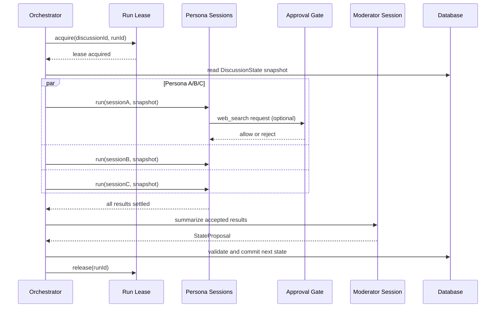

# Discussion 并行 Persona 与 Discussion 级 web_search 审批设计

## 1. 目标

将多人 Discussion 的执行模型改为“同一轮 Persona 并行、Moderator 串行汇总”，并把 `web_search` 的审批范围从单个 DSH Session 提升为当前 Discussion 内的所有 Persona Session。

本设计解决以下问题：

1. 多个独立 Persona Session 不再因为 Orchestrator 的串行 `await` 相互等待；
2. 用户只需对同一 Discussion 的 `web_search` 做一次决定；
3. 同一 Discussion 后续创建或恢复的 Persona Session 继承该决定；
4. 并发回合中的失败、取消、重复启动和迟到回调不会污染 Discussion 状态；
5. Moderator 仍然不能使用 `web_search`。

## 2. 已确认的产品语义

### 2.1 回合语义

同一轮的 Persona 不需要看到其他 Persona 本轮刚生成的回复。每个 Persona 使用同一个轮次开始时的 `DiscussionState` 快照独立思考，全部完成后再交给 Moderator 汇总。

因此，当前 prompt 中“本轮已完成发言”的串行上下文不再作为同轮输入。跨 Persona 的信息通过 Moderator 提交的共享状态进入下一轮。

### 2.2 web_search 权限边界

授权键为：

```text
discussionId + capability(web_search)
```

授权覆盖当前 Discussion 下所有现有和后续 Persona Session，包括重试和后续轮次；不覆盖其他 Discussion，也不覆盖 Moderator Session。

最终放行必须同时满足：

```text
Discussion grant = allowed
AND session kind = persona
AND Persona manifest allows web_search
```

因此 Discussion 级授权不能绕过 Persona manifest 的 allowlist。

### 2.3 拒绝语义

用户选择拒绝后，当前 Discussion 的 `web_search` 状态变为 `denied`。当前和后续所有 Persona 的 `web_search` 请求都直接拒绝，不再弹出审批卡片；拒绝只针对工具调用，不主动终止 Persona 回合。若 DSH runtime 因工具拒绝导致回合失败，则按既有 `DSH_TURN_FAILED` 规则处理。

### 2.4 生命周期

授权状态属于 Discussion 生命周期：

- Discussion 运行、完成或恢复期间保持；
- 归档后不再接受新的工具请求；
- 删除 Discussion 时删除授权记录并取消内存中的等待请求；
- 服务重启后保留已作出的 `allowed/denied` 决定；重启期间尚未作出决定的 pending 请求重新进入 `unset`，由新的工具请求重新触发审批。

## 3. 总体架构

```text
Discussion
├── one Discussion run lease
├── one DSH runner process
├── Persona A stable Session
├── Persona B stable Session
├── Persona C stable Session
├── Moderator stable Session
└── web_search DiscussionCapabilityGrant
        ├── unset
        ├── pending (memory rendezvous)
        ├── allowed (database)
        └── denied (database)
```

仍然是“一条 Discussion 一个 runner 进程、多个逻辑 DSH Session”。不为每个 Persona 新建操作系统级 runner，避免进程数量随人格数量线性增长。

## 4. 并行回合数据流



### 4.1 Persona 并行执行

在每轮开始时：

1. 读取一次 Discussion、Persona 配置和共享状态；
2. 为每个 Persona 构造只依赖轮次快照的 prompt；
3. 使用有界并发运行 Persona DSH Session；
4. 使用 `Promise.allSettled` 等待所有任务完成或失败；
5. 按 `personaIds` 配置顺序整理结果，不使用网络完成顺序；
6. 只有至少一个真实 Persona 消息成功时才进入 Moderator。

并发上限使用 `BT_DSH_MAX_PARALLEL_PERSONAS`，默认值为 `4`，有效范围为 `1..8`。人数超过上限时排队，但仍属于同一轮和同一个状态快照。

### 4.2 Moderator 汇总

Moderator 在所有 Persona 任务 settled 后才运行，且每轮只有一个 Moderator Session 调用。当前阶段继续沿用现有 `acceptedMessageIds` 输入边界；完整 Persona 正文注入 Moderator 属于后续讨论质量增强，不作为本次并行改造的隐式前提。

Moderator 的 manifest 不注册 `web_search`。即使 Discussion grant 为 `allowed`，运行时审批边界仍按 `session kind` 拒绝 Moderator。

## 5. 审批模型

### 5.1 持久化记录

新增 Discussion 能力授权记录，逻辑字段如下：

```text
DiscussionCapabilityGrant
  id
  discussionId
  capability          // 当前只允许 web_search
  status              // allowed | denied
  decidedAt
  decidedBy           // 当前用户身份；本地无身份系统时可为空
  createdAt
  updatedAt
```

数据库约束：

```text
UNIQUE(discussionId, capability)
INDEX(discussionId, status)
```

没有数据库记录等价于 `unset`。`pending` 不作为长期状态保存，由进程内 Bridge 管理。

### 5.2 内存 Bridge

Bridge 负责：

- 将同一 `discussionId + toolName` 的并发请求合并为一个 pending 审批；
- 发布一条审批事件给 SSE/UI；
- 用户决定后释放该 Discussion 下所有等待者；
- 监听 AbortSignal，在归档、删除、runner 关闭或超时时释放等待者；
- 先读取数据库 grant，再决定是否需要创建 pending。

Bridge 不负责决定 Moderator 是否可用工具；该边界由服务端根据 Discussion、Session 和 manifest 再次校验。

### 5.3 审批接口

前端审批接口继续使用 Discussion 路径，但 outcome 语义调整为：

```text
allowed-discussion
rejected-discussion
```

`allowed-once` 可以继续保留，表示只放行当前工具调用，不写入 Discussion grant。UI 默认主要展示：

```text
允许本次讨论
拒绝本次讨论
```

服务端必须校验：

1. 路径中的 Discussion 与 approval record 一致；
2. approval record 属于当前用户可访问的 Discussion；
3. capability 只能是 `web_search`；
4. Session 属于该 Discussion；
5. Moderator Session 不能通过该接口获得 Persona 工具授权。

### 5.4 并发审批行为

如果 Persona A、B、C 同时请求 `web_search`：

1. 第一个请求创建 pending approval；
2. 后续请求加入同一个等待集合；
3. UI 只收到一个 `approval-request`；
4. 允许时所有等待者收到 `allowed-once`，之后的新请求读取数据库 `allowed`；
5. 拒绝时所有等待者收到 `rejected`，之后的新请求直接返回 `rejected`，不再创建审批项。

## 6. 运行锁与并发安全

### 6.1 Discussion run lease

每次 `runDiscussion` 生成唯一 `runId`，取得 Discussion 级 lease。lease 至少包含：

```text
discussionId
runId
status = running | released | expired
leaseUntil
createdAt
updatedAt
```

同一 Discussion 只能有一个未过期的 running lease。获取和释放必须使用带条件的数据库更新，不能依赖普通的先读后写。

### 6.2 迟到回调

Persona 回合、消息写入和状态更新必须携带当前 `runId` 或能够验证当前 lease。以下情况的迟到结果不得写入成功状态：

- lease 已被其他 runId 取代；
- Discussion 已归档或删除；
- 当前 Discussion 已进入 failed/done 且不允许继续执行；
- 当前 Persona 回合已被取消。

致命错误发生时，可以取消仍在运行的任务；如果底层 SDK 无法取消单个 Session，至少要让任务安全 settled，并在落库前丢弃过期结果。

### 6.3 Runner 并发

继续复用一个 Discussion runner。不同 Session 通过 `requestId` 和 `sessionId` 分流事件；同一个 Session 仍禁止重入。必须增加集成测试验证：

- 不同 Session 同时运行不会互相收到事件；
- 同一 Session 重入仍返回 busy；
- 一个 Session 的 `DSH_TURN_FAILED` 不会自动失败其他 Session；
- runner fatal 时所有 pending Session 都能结束。

## 7. 失败与状态规则

| 情况 | Persona 结果 | 其他 Persona | Moderator | Discussion |
|---|---|---|---|---|
| 单个 `DSH_TURN_FAILED` | failed | 继续 | 有其他真实回复时运行 | 可继续本轮 |
| 全部 Persona 失败 | failed | 无 | 不运行 | failed |
| manifest/权限/协议/runner fatal | failed | 取消或丢弃迟到结果 | 不运行 | failed |
| web_search 被拒绝但模型继续回答 | completed | 正常 | 正常 | 正常 |
| web_search 拒绝导致模型回合失败 | failed | 继续 | 有其他回复时运行 | 按既有规则处理 |
| Moderator 空回复/非法 JSON | 已完成结果保留 | 无 | failed | failed |
| Discussion 被删除 | 取消 | 取消 | 取消 | DB 与 runtime 一并清理 |

并行任务必须先全部 settled，再统一执行本轮最终状态判断，避免一个任务的异常导致其他 Promise 未被观察。

## 8. 明确不纳入本次设计

以下内容保持现状，不因并行改造自动扩大范围：

1. Moderator 接收完整 Persona 回复正文；
2. 多人 steer 的完整实时接入；
3. `DiscussionState` 的真正版本 CAS；
4. runner 重启后从数据库完整重建每个 DSH Session 历史；
5. archive/purge 调度；
6. 前端整体 SSE/轮询架构重写；
7. provider/baseURL 路由重构。

这些限制必须在文档和验收结果中明确标注，不能把“并行完成”表述为“多人上下文完整恢复”。

## 9. 测试与验收标准

### 9.1 审批单元测试

- 同一 Discussion 的三个不同 Persona Session 只产生一个 pending approval；
- `allowed-discussion` 同时释放三个等待者；
- 后续 Persona Session 直接放行；
- `rejected-discussion` 同时拒绝三个等待者；
- 后续请求不再创建审批；
- 其他 Discussion 不继承授权；
- Moderator Session 即使 Discussion 已允许也被拒绝；
- 服务重启后 `allowed/denied` 从数据库恢复；
- 删除/归档会取消 pending waiter。

### 9.2 Orchestrator 单元测试

- 三个 Persona 在同一轮确实并发启动；
- prompt 都使用同一个轮次状态快照；
- 结果按 `personaIds` 顺序整理；
- 一个 `DSH_TURN_FAILED` 不阻止其他 Persona 和 Moderator；
- fatal 错误不会让迟到回调写入成功状态；
- 所有人格失败时不调用 Moderator；
- Moderator 只在所有 Persona 任务 settled 后调用；
- 重复调用 `runDiscussion` 只能有一个 run lease 成功。

### 9.3 Runtime 集成测试

- 不同 Session 在同一 runner 中并发运行；
- notification 按 `requestId/sessionId` 正确分发；
- web_search 审批事件能在并发请求下正确合并；
- runner fatal 能结束所有 pending turn；
- 删除 Discussion 能关闭 runner、取消审批并阻止迟到写入。

### 9.4 发布前验证

```text
npm test
npm run typecheck
npm run lint
npm run build
git diff --check
```

额外执行一次 3 Persona、2 轮、至少 1 次 web_search 的真实本地验收，确认 UI 只出现一张审批卡片，允许后所有 Persona Session 都能继续。

## 10. 成功标准

本设计实施完成后，应满足：

1. 同一轮多个 Persona 不再串行等待；
2. web_search 只需在 Discussion 第一次使用时审批一次；
3. 允许后所有 Persona Session，包括后续轮次和重试，都能使用 web_search；
4. 拒绝后本 Discussion 的所有 Persona Session 都不能再次触发审批；
5. Moderator 永远不能使用 web_search；
6. 并发失败不会产生未观察 Promise、错误状态覆盖或迟到消息污染；
7. 重复启动、删除、归档和服务重启都有明确且可测试的行为。
